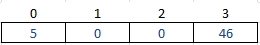
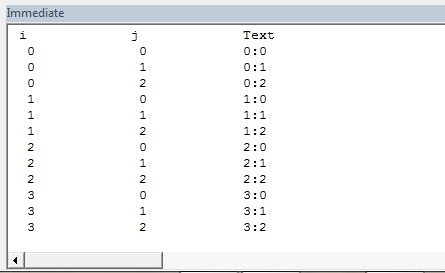
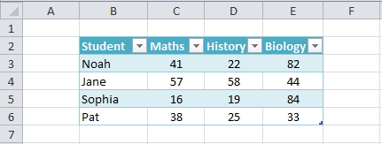
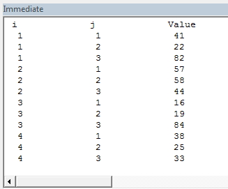

# VBA - Basics

- [VBA - Basics](#vba---basics)
  - [Variables](#variables)
    - [Data Types](#data-types)
    - [Option Explicit](#option-explicit)
    - [Procedure (local) scope](#procedure-local-scope)
    - [Module scope](#module-scope)
    - [Public scope](#public-scope)
    - [Declare and manage](#declare-and-manage)
- [What are Arrays and Why do You Need Them?](#what-are-arrays-and-why-do-you-need-them)
  - [Types of VBA Arrays](#types-of-vba-arrays)
  - [Declaring an Array](#declaring-an-array)
  - [Assigning Values to an Array](#assigning-values-to-an-array)
  - [Get the Array Size](#get-the-array-size)
  - [Using the Array and Split function](#using-the-array-and-split-function)
  - [Using Loops With Arrays](#using-loops-with-arrays)
    - [Using the For Each Loop](#using-the-for-each-loop)
  - [Using Erase](#using-erase)
  - [ReDim with Preserve](#redim-with-preserve)
    - [Using Preserve with 2 Dimensional Arrays](#using-preserve-with-2-dimensional-arrays)
  - [Sorting an Array](#sorting-an-array)
  - [Passing an Array to a Sub or Function](#passing-an-array-to-a-sub-or-function)
  - [Returning an Array from a Function](#returning-an-array-from-a-function)
  - [Two Dimensional Arrays](#two-dimensional-arrays)
    - [Using the For Each Loop](#using-the-for-each-loop-1)
  - [Reading from a Range of Cells to an Array](#reading-from-a-range-of-cells-to-an-array)
- [vba - A Quick Guide to VBA Arrays](#vba---a-quick-guide-to-vba-arrays)
- [How To Make Your Macros Run at Super Speed](#how-to-make-your-macros-run-at-super-speed)
  - [Conclusion](#conclusion)
- [Scripting](#scripting)
  - [Sheets](#sheets)
  - [Cells](#cells)
    - [Relative reference notations](#relative-reference-notations)
  - [Arrays](#arrays)
    - [1D](#1d)
    - [2D](#2d)
    - [Dynamic](#dynamic)
    - [Loops](#loops)
    - [Erase](#erase)
  - [User-Defined VBA Function \& Sub Procedures](#user-defined-vba-function--sub-procedures)
    - [Arguments](#arguments)
    - [VBA Function Procedures](#vba-function-procedures)
    - [Calling VBA Function Procedures](#calling-vba-function-procedures)
    - [VBA Sub Procedures](#vba-sub-procedures)
    - [Calling Excel VBA Sub Procedures](#calling-excel-vba-sub-procedures)
    - [Scope of VBA Procedures](#scope-of-vba-procedures)
    - [Early Exit From VBA Function \& Sub Procedures](#early-exit-from-vba-function--sub-procedures)
    - [Differences](#differences)
  - [Named Ranges](#named-ranges)
- [vba - VBA On Error Statement](#vba---vba-on-error-statement)
  - [**Definition of VBA On Error Statement:**](#definition-of-vba-on-error-statement)
  - [**Syntax of On Error Statement:**](#syntax-of-on-error-statement)
    - [**1. On Error Goto 0**](#1-on-error-goto-0)
    - [**2. On Error Resume Next**](#2-on-error-resume-next)
    - [3. On Error Goto _label_:](#3-on-error-goto-label)
- [VBA Shell Syntax](#vba-shell-syntax)
  - [Examples of Using Shell](#examples-of-using-shell)
    - [External Commands](#external-commands)
    - [Internal Commands](#internal-commands)
  - [Asynchronous Execution](#asynchronous-execution)
  - [Error handling](#error-handling)
- [Timebombing A Workbook](#timebombing-a-workbook)
  - [Introduction](#introduction)
  - [TimeBomb With A Defined Name](#timebomb-with-a-defined-name)
  - [TimeBomb With Suicide](#timebomb-with-suicide)
  - [TimeBomb To Read-Only](#timebomb-to-read-only)
  - [TimeBomb With Registry](#timebomb-with-registry)
  - [Making The Code Run At Open](#making-the-code-run-at-open)

---


## Variables

The scope of a variable is determined at the time the variable is declared. In Microsoft Visual Basic for Applications, the three scopes available for variables are procedure, module, and public.  

### Data Types

All variables and constants have a data type. The following table shows the VBA data types, along with a description of each type and the range of possible values.

| Data Type | Size in Memory | Description                                                  | Range of Values                                              |
| --------- | -------------- | ------------------------------------------------------------ | ------------------------------------------------------------ |
| Byte      | 1 byte         | Represents an unsigned (non-negative) number - often used for binary data | 0 *to* 255                                                   |
| Boolean   | 2 bytes        | A simple True or False value                                 | True *or* False                                              |
| Integer   | 2 bytes        | Integer (no decimals)                                        | -32,768 *to* +32,767                                         |
| Long      | 4 bytes        | Long Integer (no decimals)                                   | -2,147,483,648 *to* +2,147,483,647                           |
| Single    | 4 bytes        | Single Precision Floating Point Number                       | -3.4e38 *to* +3.4e38                                         |
| Double    | 8 bytes        | Double Precision Floating Point Number                       | -1.8e308 *to* +1.8e308                                       |
| Currency  | 8 bytes        | A Floating Point Number with a fixed number of decimal places | -922,337,203,685,477.5808 *to* +922,337,203,685,477.5807     |
| Date      | 8 bytes        | Date & Time - The Date type is represented internally by a floating point number. The integer part of the number represents the date, and the decimal portion represents the time. | 1st January 100 *to* 31st December 9999                      |
| Object    | 4 bytes        | A reference to an object                                     | Any Object Reference                                         |
| String    | varies         | Holds a series of characters. The String type can be defined to have a fixed or a variable length, although it is most commonly defined to have a variable length | Fixed - Up to 65,500 characters Variable - Up to approx. 2 billion characters |
| Variant   | varies         | Can hold Dates, Floating Point Numbers or Strings of Characters, and should therefore be used when you are not sure what type of data to expect. | Number - same as Double Type String - same as String Type    |

### Option Explicit

The option 'Explicit' forces you to declare all variables that you use in your VBA code, by highlighting any undeclared variables as errors during compilation (before the code will  run). To use this option, simply type the line

Option Explicit

at the very top of your VBA file.

If you want to always include the option Explicit at the top of every new VBA module that you open up, this can be done automatically via the 'Require Variable Declaration' option of your VBA editor.

To activate this:

- In the Visual Basic Editor, select **Tools→Options...**;
- Ensure the **Editor** tab is selected;
- Check the box next to the option **Require Variable Declaration** and click OK.

Once the 'Require Variable Declaration' option is selected, the Option Explicit will automatically be inserted at the top of all new modules in the VBA Editor.

### Procedure (local) scope

A local variable with procedure scope is recognized only within the procedure in which it is declared. A local variable can be declared with a Dim or Static statement.

```vbscript
Dim
```

When a local variable is declared with the Dim statement, the variable remains in existence only as long as the procedure in which it is declared is running. Usually, when the procedure is finished running, the values of the procedure's local variables are not preserved, and the memory allocated to those variables is released. The next time the procedure is executed, all of its local variables are reinitialized.

 For example, in the following sample macros, "Example1" and "Example2," the variable X is declared in each of the modules. Each variable X is independent of the other--the variable is only recognized within its respective procedure.

```vbscript
   Sub Example1()
      Dim X As Integer
      ' Local variable, not the same as X in Example2.
      X = 100
      MsgBox "The value of X is " & X
   End Sub
```

```vbscript
   Sub Example2()
      Dim X As String
      ' Local variable, not the same as X in Example1.
      X = "Yes"
      MsgBox "The answer is " &X
   End Sub
```

**Static**:

A local variable declared with the Static statement remains in existence the entire time Visual Basic is running. The variable is reset when any of the following occur:

The macro generates an untrapped run-time error.

- Visual Basic is halted.
- You quit Microsoft Excel.
- You change the module.

For example, in the RunningTotal example, the Accumulate variable retains its value every time it is executed. The first time the module is run, if you enter the number , the message box will display the value "2." The next time the module is run, if the value 3 is entered, the message box will display the running total value to be 5.

```vbscript
   Sub RunningTotal()
      Static Accumulate
      ' Local variable that will retain its value after the module
      ' has finished executing.
      num = Application.InputBox(prompt:="Enter a number: ", Type:=1)
      Accumulate = Accumulate + num
      MsgBox "The running total is " & Accumulate
   End Sub
```

### Module scope

```vbscript
   Dim A As Integer        ' Module-level variable.
   Private B As Integer    ' Module-level variable.

   Sub Example1()
       A = 100
       B = A + 1
   End Sub

   Sub Example2()
       MsgBox "The value of A is " & A
       MsgBox "The value of B is " & B
   End Sub

   Sub Example3()
        Dim C As Integer    ' Local variable.
        C = A + B
        MsgBox "The value of C is " & C
   End Sub

   Sub Example4()
        MsgBox A
        ' The message box displays the value of A.
        MsgBox B
        ' The message box displays the value of B.
        MsgBox C
        ' The message box displays nothing because C was a local variable.
   End Sub
```

### Public scope

A public variable, like a module-level variable, is declared at the top of the module, above the first procedure definition. A public variable cannot be declared within a procedure. A public variable is always declared with a "Public" statement. A public variable may be declared in any module sheet.
It is possible for multiple module sheets to have public variables with the same name. To avoid confusion and possible errors, it is a good idea to use unique names or to precede each variable name with a module qualifier (for example, in a module named "Feb_Sales" you may want to precede all public variables with the letters "FS").

### Declare and manage

There is no shorthand in VBA that allows to declare and assign variables simultaneously.

However, a visual thing can be obtained by using the continuation character `: ` in order to improve the readability of the code.

```vbscript
Dim clientToTest As String:  clientToTest = clientsToTest(i)
Dim clientString As Variant: clientString = Split(clientToTest)
```

Variable names can be declared in the single module (**Private**) or for the whole worksheet (**Public**) before any other macro is defined. Then a reliable management of the variable assignment can be achieved through a **Sub** that assign values to all the variables declared previously.

Finally the assignment sub can be called at the beginning of the calculation macro: in this way all the variables are properly declared and defined, and their management is eased.

```vbscript
Public a As Double
Public b As Double
    
Sub assign_var()
    a = Range("A1").Value
    b = Range("B1").Value
End Sub

Sub calc()
    Call assign_var
    Debug.Print a + b
End Sub
```

#  [What are Arrays and Why do You Need Them?](https://excelmacromastery.com/excel-vba-array/)

**A VBA array** is a type of variable. It is used to store lists of data of the same type. An example would be storing a list of countries or a list of weekly totals.

In VBA a normal variable can store only one value at a time. 


 The following example shows a variable being used to store the marks of a student.

```vbscript
' Can only store 1 value at a time
Dim Student1 As Integer
Student1 = 55
```


   If we wish to store the marks of another student then we need to create a second variable.

   In the following example we have the marks of five students

   

   **Student Marks**

   We are going to read these marks and write them to the Immediate Window.

   **Note:** The function Debug.Print writes values to the Immediate  Window. To view this window select View->Immediate Window from the menu( Shortcut is `Ctrl + G`)

   [](https://excelmacromastery.com/wp-content/uploads/2014/12/ImmediateWindow2.jpg)

​    

   [](https://excelmacromastery.com/wp-content/uploads/2014/12/ImmediateSampeText.jpg)

​    

   As you can see in the following example we are writing the same code five times – once for each student

   ```vbscript
   Public Sub StudentMarks()
   
       ' Get the worksheet called "Marks"
       Dim sh As Worksheet
       Set sh = ThisWorkbook.Worksheets("Marks")
       
       ' Declare variable for each student
       Dim Student1 As Integer
       Dim Student2 As Integer
       Dim Student3 As Integer
       Dim Student4 As Integer
       Dim Student5 As Integer
   
       ' Read student marks from cell
       Student1 = sh.Range("C" & 3)
       Student2 = sh.Range("C" & 4)
       Student3 = sh.Range("C" & 5)
       Student4 = sh.Range("C" & 6)
       Student5 = sh.Range("C" & 7)
   
       ' Print student marks
       Debug.Print "Students Marks"
       Debug.Print Student1
       Debug.Print Student2
       Debug.Print Student3
       Debug.Print Student4
       Debug.Print Student5
   
   End Sub
   ```

​    

   The following is the output from the example

   [](https://excelmacromastery.com/wp-content/uploads/2015/01/StuMarksOutput.png)

   **Output**

   The problem with using one variable per student is that you need to add code for each student. Therefore if you had a thousand students in the above example you would need three thousand lines of code!

   Luckily we have arrays to make our life easier. Arrays allow us to store a list of data items in one structure.

   The following code shows the above student example using an array

   ```vbscript
   ' ExcelMacroMastery.com
   ' https://excelmacromastery.com/excel-vba-array/
   ' Author: Paul Kelly
   ' Description: Reads marks to an Array and write
   ' the array to the Immediate Window(Ctrl + G)
   ' TO RUN: Click in the sub and press F5
   Public Sub StudentMarksArr()
   
       ' Get the worksheet called "Marks"
       Dim sh As Worksheet
       Set sh = ThisWorkbook.Worksheets("Marks")
   
       ' Declare an array to hold marks for 5 students
       Dim Students(1 To 5) As Long
   
       ' Read student marks from cells C3:C7 into array
       ' Offset counts rows from cell C2.
       ' e.g. i=1 is C2 plus 1 row which is C3
       '      i=2 is C2 plus 2 rows which is C4
       Dim i As Integer
       For i = 1 To 5
           Students(i) = sh.Range("C2").Offset(i).Value
       Next i
   
       ' Print student marks from the array to the Immediate Window
       Debug.Print "Students Marks"
       For i = LBound(Students) To UBound(Students)
           Debug.Print Students(i)
       Next i
   
   End Sub
   ```

   The advantage of this code is that it will work for any number of students. If we have to change this code to deal with 1000 students we only need to change the **(1 To 5)** to **(1 To 1000)** in the declaration. In the prior example we would need to add approximately five thousand lines of code.

   Let’s have a quick comparison of variables and arrays. First we compare the declaration

   ```vbscript
           ' Variable
           Dim Student As Integer
           Dim Country As String
   
           ' Array
           Dim Students(1 To 3) As Integer
           Dim Countries(1 To 3) As String
   ```

   Next we compare assigning a value

   ```vbscript
           ' assign value to variable
           Student1 = .Cells(1, 1) 
   
           ' assign value to first item in array
           Students(1) = .Cells(1, 1)
   ```

   Lastly we look at writing the values

   ```vbscript
           ' Print variable value
           Debug.Print Student1
   
           ' Print value of first student in array
           Debug.Print Students(1)
   ```

   As you can see, using variables and arrays is quite similar.

   The fact that arrays use an index(also called a subscript) to access each item is important. It means we can easily access all the items in an array using a For Loop.

   Now that you have some background on why arrays are useful lets go through them step by step.

## Types of VBA Arrays

There are two types of arrays in VBA

1. **Static** – an array of fixed size.
2. **Dynamic** – an array where the size is set at run time

The difference between these arrays mainly in how they are created. Accessing values in both array types is exactly the same. In the following sections we will cover both types.


## Declaring an Array

A static array is declared as follows

```vbscript
   Public Sub DecArrayStatic()

       ' Create array with locations 0,1,2,3
       Dim arrMarks1(0 To 3) As Long
   
       ' Defaults as 0 to 3 i.e. locations 0,1,2,3
       Dim arrMarks2(3) As Long
   
       ' Create array with locations 1,2,3,4,5
       Dim arrMarks3(1 To 5) As Long
   
       ' Create array with locations 2,3,4 ' This is rarely used
       Dim arrMarks4(2 To 4) As Long
   
   End Sub
```

​    


   [](https://excelmacromastery.com/wp-content/uploads/2015/01/A-simple-Array.jpg)

**An Array of 0 to 3**

As you can see the size is specified when you declare a static array. The problem with this is that you can never be sure in advance the size you need. Each time you run the Macro you may have different size requirements.

   If you do not use all the array locations then the resources are being wasted. If you need more locations you can use **ReDim** but this is essentially creating a new static array.

The dynamic array does not have such problems. You do not specify the size when you declare it. Therefore you can then grow and shrink as required

```vbscript
   Public Sub DecArrayDynamic()

       ' Declare  dynamic array
       Dim arrMarks() As Long
   
       ' Set the size of the array when you are ready
       ReDim arrMarks(0 To 5)
   
   End Sub
```

​    

The dynamic array is not allocated until you use the ReDim statement. The advantage is you can wait until you know the number of items before setting the array size. With a static array you have to give the size up front.

   To give an example. Imagine you were reading worksheets of student marks. With a dynamic array you can count the students on the worksheet and set an array to that size. With a static array you must set the size to the largest possible number of students.


   ## Assigning Values to an Array

   To assign values to an array you use the number of the location. You assign the value for both array types the same way.

```vbscript
   Public Sub AssignValue()

       ' Declare  array with locations 0,1,2,3
    Dim arrMarks(0 To 3) As Long
   
       ' Set the value of position 0
    arrMarks(0) = 5
   
    ' Set the value of position 3
       arrMarks(3) = 46

       ' This is an error as there is no location 4
       arrMarks(4) = 99
   
   End Sub
```

​    


   [](https://excelmacromastery.com/wp-content/uploads/2015/01/A-simple-Array-2.jpg)

   **The array with values assigned**

​    

   The number of the location is called the subscript or index. The last line in the example will give a “Subscript out of Range” error as there is no location 4 in the array example.

   ## Get the Array Size

   There is no native function for getting the number of items in an array. I created the *ArraySize* function below to return the number of item in any array no matter how many dimensions:

   ```vbscript
' Name: ArraySize()
   ' Author: Paul Kelly, ExcelMacroMastery.com
   ' Description: Returns the number of items in an array (includes
   '               multi-dimensional arrays)
' The function raises an error if the argument is not an array
   Function ArraySize(arr As Variant) As Long

       On Error Goto eh
    
       Dim i As Long
    ' Loop is used for multidimensional arrays
       Do While True
           i = i + 1
           ArraySize = IIf(ArraySize = 0, 1, ArraySize) _
                           * (UBound(arr, i) - LBound(arr, i) + 1)
       Loop
   
   Done:
       Exit Function
   eh:
       If Err.Number = 13 Then ' Type Mismatch Error
           Err.Raise vbObjectError, "ArraySize" _
               , "The argument passed to the ArraySize function is not an array."
       End If
   End Function
   ```


   You can use it like this:

   ```vbscript
   ' Name: TEST_ArraySize
   ' Author: Paul Kelly, ExcelMacroMastery.com
   ' Description: Tests the ArraySize functions and writes
   '              the results to the Immediate Window(Ctrl + G)
   Sub TEST_ArraySize()
       
       ' 0 items
    Dim arr1() As Long
       Debug.Print ArraySize(arr1)
       
    ' 10 items
       Dim arr2(0 To 9) As Long
       Debug.Print ArraySize(arr2)
       
       ' 18 items
       Dim arr3(0 To 5, 1 To 3) As Long
       Debug.Print ArraySize(arr3)
       
       ' Option base 0: 144 items
       ' Option base 1: 50 items
       Dim arr4(1, 5, 5, 0 To 1) As Long
       Debug.Print ArraySize(arr4)
       
   End Sub
   ```

   ## Using the Array and Split function

   You can use the **Array** function to populate an array with a list of items. You must declare the array as a type Variant. The following code shows you how to use this function.

   ```vbscript
       Dim arr1 As Variant
       arr1 = Array("Orange", "Peach","Pear")
   
       Dim arr2 As Variant
    arr2 = Array(5, 6, 7, 8, 12)
   ```

​    


[](https://excelmacromastery.com/wp-content/uploads/2015/01/ArrayFunction.png)

   **Contents of arr1 after using the Array function**

The array created by the Array Function will start at index zero unless you use **Option Base 1** at the top of your module. Then it will start at index one. In programming it is generally considered poor practice to have your actual data in the code. However sometimes it is useful when you need to test some code quickly. The **Split** function is used to split a string into an array based on a delimiter. A delimiter is a character such as a comma or space that separates the items.

​    

   The following code will split the string into an array of three elements.

   ```vbscript
    Dim s As String
       s = "Red,Yellow,Green,Blue"

       Dim arr() As String
       arr = Split(s, ",")
   ```

​    

   


   [](https://excelmacromastery.com/wp-content/uploads/2015/01/Arrays-Split.png)

   **The array after using Split**

   


   The Split function is normally used when you read from a comma separated file or another source that provides a list of items separated by the same character.


   ## Using Loops With Arrays

   Using a [For](https://excelmacromastery.com/vba-for-loop/#The_VBA_For_Loop) Loop allows quick access to all items in an array. This is where the power of using arrays becomes apparent. We can read arrays with ten values or ten thousand values using the same few lines of code. There are two functions in VBA called LBound and UBound. These functions return the smallest and largest subscript in an array. In an array arrMarks(0 to 3) the LBound will return 0 and UBound will return 3.

​    

The following example assigns random numbers to an array using a loop. It then prints out these numbers using a second loop.

```vbscript
   Public Sub ArrayLoops()
   
    ' Declare  array
       Dim arrMarks(0 To 5) As Long

       ' Fill the array with random numbers
    Dim i As Long
       For i = LBound(arrMarks) To UBound(arrMarks)
           arrMarks(i) = 5 * Rnd
       Next i

       ' Print out the values in the array
       Debug.Print "Location", "Value"
       For i = LBound(arrMarks) To UBound(arrMarks)
           Debug.Print i, arrMarks(i)
       Next i
   
   End Sub
```

​    

   The functions **LBound** and **UBound** are very useful. Using them means our loops will work correctly with any array size. The real benefit is that if the size of the array changes we do not have to change the code for printing the values. A loop will work for an array of any size as long as you use these functions.


   ### Using the For Each Loop

   You can use the **For Each** loop with arrays. The important thing to keep in mind is that it is **Read-Only.** This means that you cannot change the value in the array.

   In the following code the value of **mark** changes but it does not change the value in the array.

```vbscript
       For Each mark In arrMarks
           ' Will not change the array value
        mark = 5 * Rnd
       Next mark
```

   The For Each is loop is fine to use for reading an array. It is neater to write especially for a[ Two-Dimensional](https://excelmacromastery.com/excel-vba-array/#Two_Dimensional_Arrays) array as we will see.

```vbscript
       Dim mark As Variant
       For Each mark In arrMarks
           Debug.Print mark
       Next mark
```


   ## Using Erase

   The **Erase** function can be used on arrays but performs differently depending on the array type.

   For a static Array the Erase function resets all the values to the default. If the array is of integers then all the values are set to zero. If the array is of strings then all the strings are set to “” and so on.

   For a Dynamic Array the Erase function DeAllocates memory. That is, it deletes the array. If you want to use it again you must use **ReDim** to Allocate memory.

 

   Lets have a look an example for the static array. This example is the same as the **ArrayLoops** example in the last section with one difference – we use Erase after setting the values. When the value are printed out they will all be zero.

   ```vbscript
Public Sub EraseStatic()
   
    ' Declare  array
       Dim arrMarks(0 To 3) As Long

       ' Fill the array with random numbers
    Dim i As Long
       For i = LBound(arrMarks) To UBound(arrMarks)
           arrMarks(i) = 5 * Rnd
       Next i

       ' ALL VALUES SET TO ZERO
       Erase arrMarks
   
       ' Print out the values - there are all now zero
       Debug.Print "Location", "Value"
       For i = LBound(arrMarks) To UBound(arrMarks)
           Debug.Print i, arrMarks(i)
       Next i
   
   End Sub
   ```

​    

   We will now try the same example with a dynamic. After we use Erase all the locations in the array have been deleted. We need to use ReDim if we wish to use the array again.

​    

   If we try to access members of this array we will get a **“Subscript out of Range”** error.

   ```vbscript
   Public Sub EraseDynamic()
   
    ' Declare  array
       Dim arrMarks() As Long
       ReDim arrMarks(0 To 3)
   
    ' Fill the array with random numbers
       Dim i As Long
       For i = LBound(arrMarks) To UBound(arrMarks)
           arrMarks(i) = 5 * Rnd
    Next i
   
       ' arrMarks is now deallocated. No locations exist.
       Erase arrMarks
   
   End Sub
   ```

​    


   ## ReDim with Preserve

   If we use **ReDim** on an existing array, then the array and its contents will be deleted.

   In the following example, the second **ReDim** statement will create a completely new array. The original array and its contents will be deleted.

   ```vbscript
   Sub UsingRedim()

       Dim arr() As String
       
    ' Set array to be slots 0 to 2
       ReDim arr(0 To 2)
    arr(0) = "Apple"
       
    ' Array with apple is now deleted
       ReDim arr(0 To 3)

   End Sub
   ```

​    

   If we want to extend the size of an array without losing the contents, we can use the **Preserve** keyword.

   When we use **Redim Preserve** the new array must start at the same starting dimension e.g.

   We cannot Preserve from (0 to 2) to (1 to 3) or to (2 to 10) as they are different starting dimensions.

   In the following code we create an array using **ReDim** and then fill the array with types of fruit.

   We then use **Preserve** to extend the size of the array so we don’t lose the original contents.

   ```vbscript
Sub UsingRedimPreserve()
   
    Dim arr() As String
       
    ' Set array to be slots 0 to 1
       ReDim arr(0 To 2)
       arr(0) = "Apple"
       arr(1) = "Orange"
    arr(2) = "Pear"
       
    ' Resize and keep original contents
       ReDim Preserve arr(0 To 5)
   
   End Sub
   ```

   You can see from the screenshots below, that the original contents of the array have been “Preserved”.

​     

   **Before ReDim Preserve**

​      

**After ReDim Preserve**

**Word of Caution:** In most cases you shouldn’t need to resize an array like we have done in this section. If you are resizing an array multiple times then you many want to considering using a [Collection](https://excelmacromastery.com/excel-vba-collections/).


### Using Preserve with 2 Dimensional Arrays

Preserve only works with the upper bound of an array.

For example, if you have a 2 dimensional array you can only preserve the second dimension as this example shows:

   ```vbscript
   Sub Preserve2D()

       Dim arr() As Long
       
    ' Set the starting size
       ReDim arr(1 To 2, 1 To 5)
    
       ' Resize the upper dimension
    ReDim Preserve arr(1 To 2, 1 To 10)
   
End Sub
   ```

​    

   If we try to use Preserve on a lower bound we will get the “Subscript out of range” error.

   In the following code we use Preserve on the first dimension. Running this code will give the “Subscript out of range” error:

   ```
   Sub Preserve2DError()
   
       Dim arr() As Long
       
    ' Set the starting size
       ReDim arr(1 To 2, 1 To 5)
       
       ' "Subscript out of Range" error
    ReDim Preserve arr(1 To 5, 1 To 5)
   
End Sub
   ```

​    

   When we read from a range to an array, it automatically creates a two dimensional array, even if we have only one column.

   The same Preserve rules apply. We can only use Preserve on the upper bound as this example shows:

   ```vbscript
   Sub Preserve2DRange()
   
       Dim arr As Variant
       
    ' Assign a range to an array
       arr = Sheet1.Range("A1:A5").Value
       
       ' Preserve will work on the upper bound only
    ReDim Preserve arr(1 To 5, 1 To 7)
   
End Sub
   ```

   ##  Sorting an Array

   There is no function in VBA for sorting an array. We can sort the worksheet cells but this could be slow if there is a lot of data.

   The QuickSort function below can be used to sort an array.

   ```vbscript
   Sub QuickSort(arr As Variant, first As Long, last As Long)
  
     Dim vCentreVal As Variant, vTemp As Variant
     
  Dim lTempLow As Long
     Dim lTempHi As Long
  lTempLow = first
     lTempHi = last
  
     vCentreVal = arr((first + last) \ 2)
  Do While lTempLow <= lTempHi
     
       Do While arr(lTempLow) < vCentreVal And lTempLow < last
         lTempLow = lTempLow + 1
       Loop
       
       Do While vCentreVal < arr(lTempHi) And lTempHi > first
         lTempHi = lTempHi - 1
       Loop
       
       If lTempLow <= lTempHi Then
       
           ' Swap values
           vTemp = arr(lTempLow)
   
           arr(lTempLow) = arr(lTempHi)
           arr(lTempHi) = vTemp
         
           ' Move to next positions
           lTempLow = lTempLow + 1
           lTempHi = lTempHi - 1
         
       End If
       
     Loop
     
     If first < lTempHi Then QuickSort arr, first, lTempHi
     If lTempLow < last Then QuickSort arr, lTempLow, last
     
   End Sub
   ```

​    

   You can use this function like this

   ```vbscript
   Sub TestSort()
   
       ' Create temp array
       Dim arr() As Variant
       arr = Array("Banana", "Melon", "Peach", "Plum", "Apple")
     
    ' Sort array
       QuickSort arr, LBound(arr), UBound(arr)

       ' Print arr to Immediate Window(Ctrl + G)
    Dim i As Long
       For i = LBound(arr) To UBound(arr)
           Debug.Print arr(i)
       Next i
   
   End Sub
   ```

​    


   ##  Passing an Array to a Sub or Function

   Sometimes you will need to pass an array to a procedure. You declare the parameter using parenthesis similar to how you declare a dynamic array.

   Passing to the procedure using ByRef means you are passing a reference of the array. So if you change the array in the procedure it will be changed when you return.


   **Note:** When you use an array as a parameter it cannot use ByVal, it must use ByRef. You can pass the array using ByVal making the parameter a variant.

   ```vbscript
   ' Passes array to a Function
Public Sub PassToProc()
       Dim arr(0 To 5) As String
    ' Pass the array to function
       UseArray arr
End Sub
   
   Public Function UseArray(ByRef arr() As String)
       ' Use array
       Debug.Print UBound(arr)
End Function
   ```

​    


   ## Returning an Array from a Function

   It is important to keep the following in mind. If you want to change an existing array in a procedure then you should pass it as a parameter using ByRef(see last section). You do not need to return the array from the procedure.

   The main reason for returning an array is when you use the procedure to create a new one. In this case you assign the return array to an array in the caller. This array cannot be already allocated. In other words you must use a dynamic array that has not been allocated.

​    

The following examples show this

   ```vbscript
Public Sub TestArray()
   
    ' Declare dynamic array - not allocated
       Dim arr() As String
    ' Return new array
       arr = GetArray

   End Sub
   
   Public Function GetArray() As String()

       ' Create and allocate new array
       Dim arr(0 To 5) As String
       ' Return array
       GetArray = arr
   
   End Function
   ```

​    


   ## Two Dimensional Arrays

   The arrays we have been looking at so far have been one dimensional arrays. This means the arrays are one list of items.

   A two dimensional array is essentially a list of lists. If you think of a single spreadsheet row as a single dimension then more than one column is two dimensional. In fact a spreadsheet is the equivalent of a 2 dimensional array. It has two dimensions – rows and columns.

   One small thing to note is that Excel treats a one-dimensional array as a row if you write it to a spreadsheet. In other words, the array *arr(1 to 5)* is equivalent to *arr(1 to 1, 1 to 5)* when writing values to the spreadsheet.

   The following image shows two groups of data. The first is a one dimensional layout and the second is two dimensional.

   

   To access an item in the first set of data(1 dimensional) all you need to do is give the row e.g. 1,2, 3 or 4.

   For the second set of data (two-dimensional) you need to give the row AND the column. So you can think of 1 dimensional being multiple columns and one row and two-dimensional as being multiple rows and multiple columns.

   **Note:** It is possible to have more than two dimensions in an array. It is rarely required. If you are solving a problem using a 3+ dimensional array then there probably is a better way to do it.

You declare a 2 dimensional array as follows

   ```vbscript
   Dim ArrayMarks(0 To 2,0 To 3) As Long
   ```

The following example creates a random value for each item in the array and the prints the values to the Immediate Window.

   ```vbscript
   Public Sub TwoDimArray()
   
    ' Declare a two dimensional array
       Dim arrMarks(0 To 3, 0 To 2) As String
   
       ' Fill the array with text made up of i and j values
    Dim i As Long, j As Long
       For i = LBound(arrMarks) To UBound(arrMarks)
           For j = LBound(arrMarks, 2) To UBound(arrMarks, 2)
               arrMarks(i, j) = CStr(i) & ":" & CStr(j)
        Next j
       Next i
   
       ' Print the values in the array to the Immediate Window
       Debug.Print "i", "j", "Value"
       For i = LBound(arrMarks) To UBound(arrMarks)
           For j = LBound(arrMarks, 2) To UBound(arrMarks, 2)
               Debug.Print i, j, arrMarks(i, j)
           Next j
       Next i
   
   End Sub
   ```

You can see that we use a second For loop inside the first loop to access all the items.


The output of the example looks like this:

   [](https://excelmacromastery.com/wp-content/uploads/2015/01/2d-Array.jpg)

 

   How this Macro works is as follows

- Enters the **i** loop

  - **i** is set to 0
  - Enters**j** loop

- **j** is set to 0

  - **j** is set to 1

- **j** is set to 2

  - Exit **j** loop

- **i** is set to 1

  - **j** is set to 0
  - **j** is set to 1
  - **j** is set to 2

- And so on until **i**=3 and **j**=2

    

You may notice that **LBound** and **UBound** have a second argument of 2. This specifies that it is the upper or lower bound of the second dimension. That is the start and end location for **j**. The default value 1 which is why we do not need to specify it for the **i**loop.


### Using the For Each Loop

Using a For Each is neater to use when reading from an array.

Let’s take the code from above that writes out the two-dimensional array

```vbscript
       ' Using For loop needs two loops
       Debug.Print "i", "j", "Value"
    For i = LBound(arrMarks) To UBound(arrMarks)
           For j = LBound(arrMarks, 2) To UBound(arrMarks, 2)
            Debug.Print i, j, arrMarks(i, j)
           Next j
    Next i
```

Now let’s rewrite it using a For each loop. You can see we only need one loop and so it is much easier to write

   ```vbscript
       ' Using For Each requires only one loop
       Debug.Print "Value"
       Dim mark As Variant
       For Each mark In arrMarks
           Debug.Print mark
       Next mark
   ```

Using the For Each loop gives us the array in one order only – from LBound to UBound. Most of the time this is all you need.


   ## Reading from a Range of Cells to an Array

   If you have read my previous post on [Cells and Ranges](https://excelmacromastery.com/excel-vba-range-cells/) then you will know that VBA has an extremely efficient way of reading from a Range of Cells to an Array and vice versa

```vbscript
   Public Sub ReadToArray()
   
       ' Declare dynamic array
    Dim StudentMarks As Variant
   
       ' Read values into array from first row
    StudentMarks = Range("A1:Z1").Value
   
    ' Write the values back to the third row
       Range("A3:Z3").Value = StudentMarks

   End Sub
```

​    

   The dynamic array created in this example will be a two dimensional array. As you can see we can read from an entire range of cells to an array in just one line.

​    

   The next example will read the sample student data below from C3:E6 of Sheet1 and print them to the Immediate Window.

   ```vbscript
   Public Sub ReadAndDisplay()
   
    ' Get Range
       Dim rg As Range
       Set rg = ThisWorkbook.Worksheets("Sheet1").Range("C3:E6")
   
    ' Create dynamic array
       Dim StudentMarks As Variant
   
       ' Read values into array from sheet1
    StudentMarks = rg.Value
   
       ' Print the array values
       Debug.Print "i", "j", "Value"
       Dim i As Long, j As Long
       For i = LBound(StudentMarks) To UBound(StudentMarks)
           For j = LBound(StudentMarks, 2) To UBound(StudentMarks, 2)
               Debug.Print i, j, StudentMarks(i, j)
           Next j
       Next i
   
   End Sub
   ```

​    


   [](https://excelmacromastery.com/wp-content/uploads/2015/01/DirectToArrayh.jpg)

   **Sample Student data**


   [](https://excelmacromastery.com/wp-content/uploads/2015/01/Output-2d-Array.jpg)

**Output from sample data**

As  you can see the first dimension(accessed using **i**) of the array is a row and the second is a column. To demonstrate this take a look at the value 44 in E4 of the sample data. This value is in row 2 column 3 of our data. You can see that 44 is stored in the array at **StudentMarks(2,3)**.

# [vba - A Quick Guide to VBA Arrays]( https://excelmacromastery.com/excel-vba-array/ )

| Task                               | Static Array                                                 | Dynamic Array                                                |
| :--------------------------------- | :----------------------------------------------------------- | :----------------------------------------------------------- |
| Declare                            | **Dim** arr(0 **To** 5) **As Long**                          | **Dim** arr() **As Long** **Dim** arr **As Variant**         |
| Set Size                           | See Declare above                                            | **ReDim** arr(0 **To** 5)**As Variant**                      |
| Get Size(number of items)          | See [ArraySize](https://excelmacromastery.com/excel-vba-array/#Get_the_Array_Size) function below. | See [ArraySize](https://excelmacromastery.com/excel-vba-array/#Get_the_Array_Size) function below. |
| Increase size (keep existing data) | Dynamic Only                                                 | **ReDim** **Preserve** arr(0 **To** 6)                       |
| Set values                         | arr(1) = 22                                                  | arr(1) = 22                                                  |
| Receive values                     | total = arr(1)                                               | total = arr(1)                                               |
| First position                     | **LBound**(arr)                                              | **LBound**(arr)                                              |
| Last position                      | **Ubound**(arr)                                              | **Ubound**(arr)                                              |
| Read all items(1D)                 | **For** i = **LBound**(arr) **To UBound**(arr) **Next** i Or **For** i = **LBound**(arr,1) **To UBound**(arr,1) **Next** i | **For** i = **LBound**(arr) **To UBound**(arr) **Next** i Or **For** i = **LBound**(arr,1) **To UBound**(arr,1) **Next** i |
| Read all items(2D)                 | **For** i = **LBound**(arr,1) **To UBound**(arr,1)   **For** j = **LBound**(arr,2) **To UBound**(arr,2)   **Next** j **Next** i | **For** i = **LBound**(arr,1) **To UBound**(arr,1)   **For** j = **LBound**(arr,2) **To UBound**(arr,2)   **Next** j **Next** i |
| Read all items                     | **Dim** item **As Variant** **For Each** item **In** arr **Next** item | **Dim** item **As Variant** **For Each** item **In** arr **Next** item |
| Pass to Sub                        | **Sub** MySub(**ByRef** arr() **As String**)                 | **Sub** MySub(**ByRef** arr() **As String**)                 |
| Return from Function               | **Function** GetArray() **As Long**()     **Dim** arr(0 **To** 5) **As Long**     GetArray = arr **End Function** | **Function** GetArray() **As Long**()     **Dim** arr() **As Long**     GetArray = arr **End Function** |
| Receive from Function              | Dynamic only                                                 | **Dim** arr() **As Long**  Arr = GetArray()                  |
| Erase array                        | **Erase** arr *Resets all values to default                  | **Erase** arr *Deletes array                                 |
| String to array                    | Dynamic only                                                 | **Dim** arr **As Variant** arr = Split("James:Earl:Jones",":") |
| Array to string                    | **Dim** sName **As String** sName = Join(arr, ":")           | **Dim** sName **As String** sName = Join(arr, ":")           |
| Fill with values                   | Dynamic only                                                 | **Dim** arr **As Variant** arr = Array("John", "Hazel", "Fred") |
| Range to Array                     | Dynamic only                                                 | **Dim** arr **As Variant** arr = Range("A1:D2")              |
| Array to Range                     | Same as dynamic                                              | **Dim** arr **As Variant** Range("A5:D6") = arr              |


# How To Make Your Macros Run at Super Speed

If your macros are running very slow then you may find this section very helpful. Especially if you are dealing with large amounts of data. The following is a well kept secret in VBA

 

   **Updating values in arrays is exponentially faster than updating values in cells.**

 


In the last section, you saw how we can easily read from a group of cells to an array and vice versa. If we are updating a lot of values then we can do the following

\1. Copy the data from the cells to an array.
   \2. Change the data in the array.
\3. Copy the updated data from the array back to the cells.

​    

For example, the following code would be much faster than the code below it

   ```vbscript
Public Sub ReadToArray()
   
    ' Read values into array from first row
       Dim StudentMarks  As Variant
       StudentMarks = Range("A1:Z20000").Value
   
    Dim i As Long
       For i = LBound(StudentMarks) To UBound(StudentMarks)
           ' Update marks here
           StudentMarks(i, 1) = StudentMarks(i, 1) * 2
        '...
       Next i
   
       ' Write the new values back to the worksheet
       Range("A1:Z20000").Value = StudentMarks
   
   End Sub
   ```

​    


   ```vbscript
   Sub UsingCellsToUpdate()
       
       Dim c As Variant
       For Each c In Range("A1:Z20000")
           c.Value = ' Update values here
       Next c
       
End Sub
   ```

 

   Assigning from one set of cells to another is also much faster than using Copy and Paste

   ```vbscript
   ' Assigning - this is faster
   Range("A1:A10").Value = Range("B1:B10").Value
   
   ' Copy Paste - this is slower
   Range("B1:B1").Copy Destination:=Range("A1:A10")
   ```

​    

   The following comments are from two readers who used arrays to speed up their macros

   *“A couple of my projects have gone from almost impossible and long to run into almost too easy and a reduction in time to run from 10:1.”* – Dane

   *“One report I did took nearly 3 hours to run when accessing the cells directly — 5 minutes with arrays”* – Jim

​    


## Conclusion

   The following is a summary of the main points of this post

1. Arrays are an efficient way of storing a **list of items** of the same type.
   2. You can access an array item directly using the number of the location which is known as the **subscript or index**.
2. The common error “**Subscript out of Range**” is caused by accessing a location that does not exist.
   4. There are two types of arrays: **Static** and **Dynamic**.
3. **Static** is used when the size of the array is always the same.
   6. **Dynamic** arrays allow you to determine the size of an array at run time.
   7. **LBound** and **UBound** provide a safe way of find the smallest and largest subscripts of the array.
4. The basic array is **one dimensional**. You can also have multi dimensional arrays.
   9. You can only pass an array to a procedure using **ByRef**. You do this like this: ByRef arr() as long.
5. You can **return an array** from a function but the array, it is assigned to, must not be currently allocated.
   11. A worksheet with its rows and columns is essentially a **two dimensional** array.
6. You can read directly **from a worksheet range** into a two dimensional array in just one line of code.
   13. You can also write from a two dimensional **array to a range** in just one line of code.

# Scripting

## Sheets

Create a new sheet and assign to its cell the cell of another one.

```vbscript
Sub Nuovo_foglio()
' Creazione di un nuovo foglio e assegnazione alla cella A1 di Foglio1!A1 
    Sheets.Add After:=ActiveSheet
    Range("A1").Select
    ActiveCell.FormulaR1C1 = "=Foglio1!RC" 'assegnazione di foglio1!A1
    'RC è un sistema di riferimento per la posizione relativa delle celle
    'nel sistema di riferimento assoluto sarebbe stato
    ActiveCell.Formula = "=Foglio1!A1"
    Range("A2").Select 'è andata a capo la selezione della cella
End Sub
```

Assign a new name to the selected sheet.

```vbscript
Sub Rinomina_foglio()
' Assegna un nuovo nome al Foglio1
    Sheets("Foglio1").Select
    Sheets("Foglio1").Name = "NuovoNome"
End Sub
```

## Cells

Assign to a cell the **value** of another one with relative reference notation.

```vbscript
Sub Assegna_val_cella()
' Assegnazione di valori alle celle con posizioni basate su SDR relativo
    Range("H6").Select
    ActiveCell.FormulaR1C1 = "=RC[-1]" 'RC[-1] = cella nella colonna a sx
    Range("H7").Select
    ActiveCell.FormulaR1C1 = "=RC[-2]" 'RC[-2] = cella due colonne a sx
    Range("H8").Select
    ActiveCell.FormulaR1C1 = "=R[1]C" 'R[1]C = cella una riga sotto
    Range("H9").Select
    ActiveCell.FormulaR1C1 = "=R[2]C" 'R[2]C = cella due righe sotto
    Range("H10").Select
End Sub
```

Assign selection to a cell.

```vb
Sub atest()
    Dim myCells As Range
    Set myCells = Selection
    MsgBox myCells.Address
End Sub
```

Assign a **formula** to a cell.

```vbscript
Sub Se()
' Funzione SE assegnata ad una cella
    ActiveCell.FormulaR1C1 = "=IF(RC[-3]=FALSE,0,1)"
    Range("H12").Select
End Sub
```

Write some **text** in a cell.

```vbscript
Sub Scrivi_testo()
' Inserisci testo in una cella
    Range("I7").Select
    ActiveCell.FormulaR1C1 = "dasfafa"
    Range("K9").Select
End Sub
```

Appearance **formatting**.

```vbscript
Sub Bordo_cella()
' Formattazione celle con i bordi
'Thin border
    Selection.Borders(xlDiagonalDown).LineStyle = xlNone
    Selection.Borders(xlDiagonalUp).LineStyle = xlNone
    With Selection.Borders(xlEdgeLeft)
        .LineStyle = xlContinuous
        .ColorIndex = 0
        .TintAndShade = 0
        .Weight = xlThin
    End With
    With Selection.Borders(xlEdgeTop)
        .LineStyle = xlContinuous
        .ColorIndex = 0
        .TintAndShade = 0
        .Weight = xlThin
    End With
    With Selection.Borders(xlEdgeBottom)
        .LineStyle = xlContinuous
        .ColorIndex = 0
        .TintAndShade = 0
        .Weight = xlThin
    End With
    With Selection.Borders(xlEdgeRight)
        .LineStyle = xlContinuous
        .ColorIndex = 0
        .TintAndShade = 0
        .Weight = xlThin
    End With
    Selection.Borders(xlInsideVertical).LineStyle = xlNone
    Selection.Borders(xlInsideHorizontal).LineStyle = xlNone
'Medium border
    Range("I11").Select
    Selection.Borders(xlDiagonalDown).LineStyle = xlNone
    Selection.Borders(xlDiagonalUp).LineStyle = xlNone
    With Selection.Borders(xlEdgeLeft)
        .LineStyle = xlContinuous
        .ColorIndex = 0
        .TintAndShade = 0
        .Weight = xlMedium
    End With
    With Selection.Borders(xlEdgeTop)
        .LineStyle = xlContinuous
        .ColorIndex = 0
        .TintAndShade = 0
        .Weight = xlMedium
    End With
    With Selection.Borders(xlEdgeBottom)
        .LineStyle = xlContinuous
        .ColorIndex = 0
        .TintAndShade = 0
        .Weight = xlMedium
    End With
    With Selection.Borders(xlEdgeRight)
        .LineStyle = xlContinuous
        .ColorIndex = 0
        .TintAndShade = 0
        .Weight = xlMedium
    End With
    Selection.Borders(xlInsideVertical).LineStyle = xlNone
    Selection.Borders(xlInsideHorizontal).LineStyle = xlNone
End Sub
```

**Merge cells**.

```vbscript
Sub Unisci_celle()
' Selezione e unione di due celle
    Range("H6:I6").Select
    With Selection
        .HorizontalAlignment = xlCenter
        .VerticalAlignment = xlCenter
        .WrapText = False
        .Orientation = 0
        .AddIndent = False
        .IndentLevel = 0
        .ShrinkToFit = False
        .ReadingOrder = xlContext
        .MergeCells = False
    End With
    Selection.Merge
End Sub
```

### Relative reference notations

Three different ways to set in the cell **D4** the formula that takes the contents of **B4** as input.

```vbscript
Range("D4").Formula = "=B3*10" 'cell name B3

Range("D4").FormulaR1C1 = "=R3C2*10" 'absolute coordinates R3C2 (i.e. B3)

Range("D4").FormulaR1C1 = "=R[-1]C[-2]*10" 'relative coordinates respect to the selected cell
```

The same result can be achieved referring to the cell **D4** by using its coordinates.

```vbscript
Cells(4,4).FormulaR1C1 = "=R[-1]C[-2]*10"
```

Also a range of cells can be selected, and the _.FormulaR1C1_ can be used.

```vbscript
Range("A1:C4").Select
'or
Range(Cells(1,1),Cells(4,4)).Select

'absolute reference, all the cells in the range have the same formula
Selection.FormulaR1C1 = "=R4C4*10"           
        
'relative reference, all the cells in the range have different formula
Selection.FormulaR1C1 = "=R[3]C[3]*10"   
        
'otherwise
Range(Cells(1,1),Cells(4,4)).FormulaR1C1 = "=R[3]C[3]*10"       
```

In order to span among all the cells by starting from a specific one, the _.Offset_ property can be used. The cell **D4** can thus be selected starting from the cell **A1** in these two ways, then the formula can be set in the selection. Otherwise one commad only ca be used.

```vbscript
Range("A1").Offset(3,3).Select
'or
Cells(1,1).Offset(3,3).Select
        
Selection.FormulaR1C1 = "=R[-1]C[-2]*10"

'otherwise
Cells(1,1).Offset(3,3).FormulaR1C1 = "=R[-1]C[-2]*10"
```

## [Arrays](https://excelmacromastery.com/excel-vba-array/)

| Task                               | Static Array                                                 | Dynamic Array                                                |
| ---------------------------------- | ------------------------------------------------------------ | ------------------------------------------------------------ |
| Declare                            | Dim arr(0 To 5) As Long                                      | Dim arr() As Long Dim arr As Variant                         |
| Set Size                           | See Declare above                                            | ReDim arr(0 To 5)As Variant                                  |
| Increase size (keep existing data) | Dynamic Only                                                 | ReDim Preserve arr(0 To 6)                                   |
| Set values                         | arr(1) = 22                                                  | arr(1) = 22                                                  |
| Receive values                     | total = arr(1)                                               | total = arr(1)                                               |
| First position                     | LBound(arr)                                                  | LBound(arr)                                                  |
| Last position                      | Ubound(arr)                                                  | Ubound(arr)                                                  |
| Read all items(1D)                 | For i = LBound(arr) To UBound(arr) Next i Or For i = LBound(arr,1) To UBound(arr,1) Next i | For i = LBound(arr) To UBound(arr) Next i Or For i = LBound(arr,1) To UBound(arr,1) Next i |
| Read all items(2D)                 | For i = LBound(arr,1) To UBound(arr,1)   For j = LBound(arr,2) To UBound(arr,2)   Next j Next i | For i = LBound(arr,1) To UBound(arr,1)   For j = LBound(arr,2) To UBound(arr,2)   Next j Next i |
| Read all items                     | Dim item As Variant For Each item In arr Next item           | Dim item As Variant For Each item In arr Next item           |
| Pass to Sub                        | Sub MySub(ByRef arr() As String)                             | Sub MySub(ByRef arr() As String)                             |
| Return from Function               | Function GetArray() As Long()     Dim arr(0 To 5) As Long     GetArray = arr End Function | Function GetArray() As Long()     Dim arr() As Long     GetArray = arr End Function |
| Receive from Function              | Dynamic only                                                 | Dim arr() As Long  Arr = GetArray()                          |
| Erase array                        | Erase arr *Resets all values to default                      | Erase arr *Deletes array                                     |
| String to array                    | Dynamic only                                                 | Dim arr As Variant arr = Split("James:Earl:Jones",":")       |
| Array to string                    | Dim sName As String sName = Join(arr, ":")                   | Dim sName As String sName = Join(arr, ":")                   |
| Fill with values                   | Dynamic only                                                 | Dim arr As Variant arr = Array("John", "Hazel", "Fred")      |
| Range to Array                     | Dynamic only                                                 | Dim arr As Variant arr = Range("A1:D2")                      |
| Array to Range                     | Same as dynamic                                              | Dim arr As Variant Range("A5:D6") = arr                      |

### 1D

```vbscript
Dim Films(1 To 5) As String

Films(1) = "Lord of the Rings"
Films(2) = "Speed"
Films(3) = "Star Wars"
Films(4) = "The Godfather"
Films(5) = "Pulp Fiction"

MsgBox Films(4)
```

### 2D

```vbscript
Dim Films(1 To 5, 1 To 2) As String
Dim i As Integer, j As Integer

For i = 1 To 5
    For j = 1 To 2
        Films(i, j) = Cells(i, j).Value
    Next j
Next i

MsgBox Films(4, 2)
```

### Dynamic

Change the size of an existing array by using **ReDim** command. 

```vbscript
Public Sub DecArrayDynamic()

    ' Declare  dynamic array
    Dim arrMarks() As Long

    ' Set the size of the array when you are ready
    ReDim arrMarks(0 To 5)
    arrMarks(0) = 12
    
    ' Array with value 12 is now deleted
	ReDim arrMarks(0 To 3)
    
End Sub
```

If we want to extend the size of an array without losing the contents, we can use the **Preserve** keyword.

When we use **Redim Preserve** the new array must be bigger and start at the same dimension e.g.

We cannot Preserve from (0 to 2) to (1 to 3) or (2 to 10) as they are different starting dimensions. 

We cannot Preserve from (0 to 2) to (0 to 1) or (0) as they are smaller than original array.

```vbscript
Sub UsingRedimPreserve()

    Dim arr() As String
    
    ' Set array to be slots 0 to 1
    ReDim arr(0 To 2)
    arr(0) = "Apple"
    arr(1) = "Orange"
    arr(2) = "Pear"
    
    ' Resize and keep original contents
    ReDim Preserve arr(0 To 5)

End Sub
```

Preserve only works with the upper bound of an array.

For example, if you have a 2 dimensional array you can only preserve the second dimension as this example shows:

```vbscript
Sub Preserve2D()

    Dim arr() As Long
    
    ' Set the starting size
    ReDim arr(1 To 2, 1 To 5)
    
    ' Resize the upper bound
    ReDim Preserve arr(1 To 2, 1 To 10)

End Sub
```

If we try to use Preserve on a lower bound we will get the “Subscript out of range” error.

In the following code we use Preserve on the lower bound. Running this code will give the “Subscript out of range” error:

```vbscript
Sub Preserve2DError()

    Dim arr() As Long
    
    ' Set the starting size
    ReDim arr(1 To 2, 1 To 5)
    
    ' "Subscript out of Range" error
    ReDim Preserve arr(1 To 5, 1 To 5)

End Sub
```

When we read from a range to an array, it automatically creates a two dimensional array, even if we have only one column.

The same Preserve rules apply. We can only use Preserve on the upper bound as this example shows:

```vbscript
Sub Preserve2DRange()

    Dim arr As Variant
    
    ' Assign a range to an array
    arr = Sheet1.Range("A1:A5").Value
    
    ' Preserve will work on the upper bound only
    ReDim Preserve arr(1 To 5, 1 To 7)

End Sub
```

### Loops

_For_ loop.

```vbscript
Public Sub ArrayLoops()

    ' Declare  array
    Dim arrMarks(0 To 5) As Long

    ' Fill the array with random numbers
    Dim i As Long
    For i = LBound(arrMarks) To UBound(arrMarks)
        arrMarks(i) = 5 * Rnd
    Next i

    ' Print out the values in the array
    Debug.Print "Location", "Value"
    For i = LBound(arrMarks) To UBound(arrMarks)
        Debug.Print i, arrMarks(i)
    Next i

End Sub
```

_For Each_ loop.

```vbscript
For Each mark In arrMarks
    ' Will not change the array value
    mark = 5 * Rnd
Next mark

Dim mark As Variant
    For Each mark In arrMarks
    Debug.Print mark
Next mark
```

### Erase

_Static_

```vbscript
Public Sub EraseStatic()

    ' Declare  array
    Dim arrMarks(0 To 3) As Long

    ' Fill the array with random numbers
    Dim i As Long
    For i = LBound(arrMarks) To UBound(arrMarks)
        arrMarks(i) = 5 * Rnd
    Next i

    ' ALL VALUES SET TO ZERO
    Erase arrMarks

    ' Print out the values - there are all now zero
    Debug.Print "Location", "Value"
    For i = LBound(arrMarks) To UBound(arrMarks)
        Debug.Print i, arrMarks(i)
    Next i

End Sub
```

_Dynamic_

```vbscript
Public Sub EraseDynamic()

    ' Declare  array
    Dim arrMarks() As Long
    ReDim arrMarks(0 To 3)

    ' Fill the array with random numbers
    Dim i As Long
    For i = LBound(arrMarks) To UBound(arrMarks)
        arrMarks(i) = 5 * Rnd
    Next i

    ' arrMarks is now deallocated. No locations exist.
    Erase arrMarks

End Sub
```

## User-Defined VBA Function & Sub Procedures

In Excel Visual Basic, a set of commands to perform a specific task is placed into a procedure, which can be a Function procedure or a Sub procedure (also known as functions and subroutines).

The main difference between a VBA Function procedure and a Sub procedure is that a Function procedure returns a result, whereas a Sub procedure does not.

Therefore, if you wish to perform a task that returns a result (e.g. summing of a group of numbers), you will generally use a Function procedure, but if you just need a set of actions to be carried out (e.g. formatting a set of cells), you might choose to use a Sub procedure.

### Arguments

VBA procedures can be passed data via *arguments*, which are declared in the procedure definition. For example, you could have a VBA Sub procedure that adds an Integer to every cell in the current selected range on a worksheet. You could supply the value of the integer to the Sub via an argument, as follows:

```vbscript
Sub AddToCells(i As Integer)
	.
    .
    .
End Sub
```

_**Optional Arguments**_

You can also define VBA procedures to have Optional arguments. These are arguments that the user can supply if they want, but if they are omitted, the procedure will assign a default value to them.

To return to the example above, if we wanted to make the supplied integer argument optional, this would be declared as follows:

_Sub AddToCells(Optional i As Integer = 0)_

In this case, the supplied integer, i, has a default value of 0.

You can use multiple Optional arguments in a VBA procedure, as long the Optionalarguments are all positioned at the end of the argument list.

_**Passing Arguments By Value and By Reference**_

When arguments are passed to VBA procedures, they can be passed in two ways:

- **ByVal** - The argument is passed by Value. This means that just the value (i.e. a copy of the argument) is passed to the procedure and therefore, any changes that are made to the argument inside the procedure will be lostwhen the procedure is exited.
- **ByRef** - The argument is passed by Reference. This means that the addressof the argument is passed to the procedure. Any changes that are made to the argument inside the procedure will be remembered when the procedure is exited.

You can specify whether an argument is passed to a VBA procedure by value or by reference by using the ByVal or the ByRef keyword when defining the procedure. This is shown below:

| Sub AddToCells(ByVal i As Integer)         **.**         **.**         **.** End Sub | In this case, the integer i is passed by Value. Any changes that are made to i will be lost when you exit the Sub procedure. |
| ------------------------------------------------------------ | ------------------------------------------------------------ |
| Sub AddToCells(ByRef i As Integer)         **.**         **.**         **.** End Sub | In this case, the integer i is passed by Reference. When you exit the Sub, any changes that have been made to i will be remembered by the variable that was passed into the Sub procedure. |

It should be noted that, by default, VBA arguments are passed by Reference. Therefore, if you do not use the ByVal or the ByRef keyword, the arguments will be passed by Reference.

Before discussing further properties of VBA Function and Sub procedures, it is useful to look at the two types of procedure individually. The following two sections provide a brief discussion of VBA Function and VBA Sub procedures, along with simple examples.

###  VBA Function Procedures

The VBA editor recognises a Function procedure, because the commands are positioned between the following start and end commands:

```vbscript
Function
    'your code here
End Function
```

As previously mentioned, VBA function procedures (unlike sub procedures) return a value. The return values have the following rules:

- The data type of the returned value must be declared in the Function header.
- The value to be returned must be assigned to a variable having the same name as the Function. This variable does not need to be declared, as it already exists as a part of the function.

This is illustrated in the following example.

_** VBA Function Procedure Example: Perform a Mathematical Operation on 3 Numbers**_

The following code shows an example of a simple VBA Function procedure that receives three arguments, each of which are 'Doubles' (double precision floating point numbers). The Function returns a further 'Double', which is the sum of the first two arguments, minus the third argument:

```vbscript
' Function to Add Two Numbers and Then Subtract a Third Number
Function SumMinus(dNum1 As Double, dNum2 As Double, dNum3 As Double) As Double
	SumMinus = dNum1 + dNum2 - dNum3
End Function
```

The above very simple VBA Function procedure illustrates the way in which data arguments are supplied to a procedure. It is also seen that the Function procedure return type is defined as being a 'Double' (i.e. by the term "As Double" which is included after the Function arguments).

The above example also shows how the Function procedure result is stored in a variable that has the same name as the Function. 

### Calling VBA Function Procedures

If the above simple Function procedure is typed into a Module in the Visual Basic Editor, it will then be available to be called from other VBA procedures or to be used in the worksheets of your Excel workbook.

_**Calling a VBA Function Procedure From Within VBA**_

You can call a Function procedure from within your VBA program by simply assigning the Function to a variable. The following example shows a call to the simple SumMinus function that was defined above:

```vbscript
Sub main()
    Dim total as Double
    total = SumMinus(5, 4, 3)
End Sub
```

_**Calling a VBA Function Procedure From A Worksheet**_

You can call VBA Function procedures from an Excel Worksheet, in the same way as you can call any of the built-in Excel functions.	

Therefore, you could call the SumMinus Function procedure by typing the following into any cell of your worksheet:

_=SumMinus(10, 5, 2)_

### VBA Sub Procedures

The VBA editor recognises a Sub procedure, because the commands are positioned between the following start and end commands: 

```vbscript
Sub
.
.
.
End Sub
```

 _**VBA Sub Procedure Example 1: Center and Apply Font Size to a Selected Range of Cells**_

The following code shows an example of a simple VBA Sub procedure that applies formatting to the current selected cell range. The cells are formatted to be aligned centrally (both horizontally and vertically) and to have a user-supplied font size:

```vbscript
' Sub Procedure to Center and Apply a Supplied Font Size to the Selected Range
Sub Format_Centered_And_Sized(Optional iFontSize As Integer = 10)
    Selection.HorizontalAlignment = xlCenter
    Selection.VerticalAlignment = xlCenter
    Selection.Font.Size = iFontSize
End Sub
```

The above example illustrates how Sub procedures perform actions but do not return values.

This example also includes the Optional argument, iFontSize. If iFontSize is not supplied to the Sub, then the default font size of 10 is used. However, if iFontSize is supplied to the Sub, then the current range is set to have the user-supplied font size.

_**VBA Sub Procedure Example 2: Center and Apply Bold Font to a Selected Range of Cells**_

The following code is similar to example 1, but instead of supplying a font size to the selected range, the cells are set to have a bold font. This example has been included to show a Sub procedure that does not receive any arguments:

```vbscript
' Sub Procedure to Center and Bold the Selected Range
Sub Format_Centered_And_Bold()
    Selection.HorizontalAlignment = xlCenter
    Selection.VerticalAlignment = xlCenter
    Selection.Font.Bold = True
End Sub
```

### Calling Excel VBA Sub Procedures

_**Calling a VBA Sub Procedure From Within VBA**_

You can call a VBA Sub procedure from your VBA program by typing the Callkeyword, followed by the Sub name and then the Sub procedure arguments enclosed in brackets. This is shown in the example below:

```vbscript
Sub main()
	Call Format_Centered_And_Sized( 20 )
End Sub
```

If the Format_Centered_And_Sized Sub procedure had more than one argument, these would be separated by commas. E.g. 

```vbscript
Sub main()
	Call Format_Centered_And_Sized( arg1, arg2, ... )
End Sub
```

_**Calling a VBA Sub Procedure From A Worksheet**_

Sub procedures cannot be typed directly into a Worksheet in Excel, in the same way that VBA Function procedures can, because Sub procedures don't return a value. However, provided they have no arguments (and are Public - see below), Excel VBA Sub procedures are still available to the user of a spreadsheet. Therefore, of the above simple Sub procedures, the Format_Centered_And_Bold Sub procedure would be available to be used in the worksheets of your Exce workbook but the Format_Centered_And_Sized would not (as it has an argument).

For those Sub procedures that are accessible from the workbook, a simple way to run (or execute) the Sub is:

- Open up the 'Macro' dialog box by either:

  - Clicking the **Macros** option from the 'Developer' tab of the Excel ribbon

  or

  - Using the keyboard shortcut  Alt + F8    (i.e. press the **Alt** key and while this is pressed down, press **F8**).

- Within the 'Macro' dialog box, select the macro you wish to run and click the **Run** button.

### Scope of VBA Procedures

These scpe keywords have the same meaning for variables when applied to VBA procedures:

| Public Sub AddToCells(i As Integer)         **.**         **.**         **.** End Sub | If a procedure declaration is preceded by the keyword Public, this makes the procedure accessible to all other modules in the VBA Project. |
| ------------------------------------------------------------ | ------------------------------------------------------------ |
| Private Sub AddToCells(i As Integer)         **.**         **.**         **.** End Sub | If a procedure declaration is preceded by the keyword Private, this makes the procedure only available to the current module. It cannot be accessed from any other modules, or from the Excel workbook. |

 **If no keyword is inserted at the start of a VBA Function or Sub declaration, then the default setting is for the procedure to be Public** (i.e. to be accessible from anywhere in the VBA Project). This differs from variable declarations, which are Private by default.

### Early Exit From VBA Function & Sub Procedures

If you want to exit a VBA Function or Sub procedure before it has run to the end, you can do this using the Exit Function or the Exit Sub command. This is illustrated below, in a simple Function procedure that expects to receive a positive value to work with. If the value received is not positive, the function cannot continue, so it highlights the error to the user and exits the procedure immediately:

```vbscript
Function VAT_Amount(sVAT_Rate As Single) As Single
    VAT_Amount = 0
    If sVAT_Rate <= 0 Then
      MsgBox "Expected a Positive value of sVAT_Rate but Received " & sVAT_Rate
      Exit Function
    End If
       .
       .
       .
End Function
```

Note that, before exiting the VAT_Amount Function procedure, the above code uses the built-in [VBA MsgBox function](https://www.excelfunctions.net/vba-msgbox-function.html), to display a box containing a warning message to the user. 

### Differences

The easiest way to think of a sub vs a function is that a function can return a value and a sub cannot.  A sub can be thought of as a small program that performs some action that is contained within the program.  Subs can be used to update a cell or perform an import and calculation, but the result can’t be returned to another sub or function. Another thing to note is that a sub (or macro) cannot be accessed directly by a cell reference.  For example, when a cell is used to show today’s date, =Today(), that formula is also a built-in function, not a sub. 

A function is similar similar to a sub, except that a function can return a value.  It may be easier to think of a function as similar to a formula in excel.  You can provide the function the necessary inputs and the function returns the desired value.  **You can build a custom function for just about any action and then access that function from either a call from a macro, or a direct reference from a cell.**

```vbscript
Public Function LastDayofMonth(myDate As Date)

    Dim tempDate As String
    Dim newDate As Date

    If Month(myDate) = 12 Then
        tempDate = CStr(“1/1/” & CStr(Year(myDate) + 1))
    Else
        tempDate = CStr(Month(myDate)) + 1 & “/1/” & CStr(Year(myDate))
    End If

    newDate = CDate(tempDate) – 1

    LastDayofMonth = newDate

End Function
```


## Named Ranges

The below VBA code shows ways you can **create various types** of named ranges. 

```vbscript
Sub NameRange_Add()
'PURPOSE: Various ways to create a Named Range
'SOURCE: www.TheSpreadsheetGuru.com

Dim cell As Range
Dim rng As Range
Dim RangeName As String
Dim CellName As String

'Single Cell Reference (Workbook Scope)
  RangeName = "Price"
  CellName = "D7"
  
  Set cell = Worksheets("Sheet1").Range(CellName)
  ThisWorkbook.Names.Add Name:=RangeName, RefersTo:=cell


'Single Cell Reference (Worksheet Scope)
  RangeName = "Year"
  CellName = "A2"
  
  Set cell = Worksheets("Sheet1").Range(CellName)
  Worksheets("Sheet1").Names.Add Name:=RangeName, RefersTo:=cell


'Range of Cells Reference (Workbook Scope)
  RangeName = "myData"
  CellName = "F9:J18"
  
  Set cell = Worksheets("Sheet1").Range(CellName)
  ThisWorkbook.Names.Add Name:=RangeName, RefersTo:=cell


'Secret Named Range (doesn't show up in Name Manager)
  RangeName = "Username"
  CellName = "L45"
  
  Set cell = Worksheets("Sheet1").Range(CellName)
  ThisWorkbook.Names.Add Name:=RangeName, RefersTo:=cell, Visible:=False

End Sub
```

This VBA macro code shows how you can **cycle through the named ranges** within your spreadsheet. 

```vbscript
Sub NamedRange_Loop()
'PURPOSE: Delete all Named Ranges in the Active Workbook
'SOURCE: www.TheSpreadsheetGuru.com

Dim nm As Name

'Loop through each named range in workbook
  For Each nm In ActiveWorkbook.Names
    Debug.Print nm.Name, nm.RefersTo
  Next nm
  
'Loop through each named range scoped to a specific worksheet
  For Each nm In Worksheets("Sheet1").Names
    Debug.Print nm.Name, nm.RefersTo
  Next nm

End Sub
```

If you need to clean up a bunch of junk named ranges, this VBA code will let you do it. 

```vbscript
Sub NamedRange_DeleteAll()
'PURPOSE: Delete all Named Ranges in the ActiveWorkbook (Print Areas optional)
'SOURCE: www.TheSpreadsheetGuru.com

Dim nm As Name
Dim DeleteCount As Long

'Delete PrintAreas as well?
  UserAnswer = MsgBox("Do you want to skip over Print Areas?", vbYesNoCancel)
    If UserAnswer = vbYes Then SkipPrintAreas = True
    If UserAnswer = vbCancel Then Exit Sub

'Error Handler in case Delete Function Errors out
  On Error GoTo Skip

'Loop through each name and delete
  For Each nm In ActiveWorkbook.Names
    If SkipPrintAreas = True And Right(nm.Name, 10) = "Print_Area" Then GoTo Skip
    
    nm.Delete
    DeleteCount = DeleteCount + 1

Skip:
    
  Next
  
'Reset Error Handler
  On Error GoTo 0
     
'Report Result
  If DeleteCount = 1 Then
    MsgBox "[1] name was removed from this workbook."
  Else
    MsgBox "[" & DeleteCount & "] names were removed from this workbook."
  End If

End Sub
```

This VBA code will delete only Named Ranges with errors in them. These errors can be caused by worksheets being deleted or rows/columns being deleted. 

```vbscript
Sub NamedRange_DeleteErrors()
'PURPOSE: Delete all Named Ranges with #REF error in the ActiveWorkbook
'SOURCE: www.TheSpreadsheetGuru.com

Dim nm As Name
Dim DeleteCount As Long

'Error Handler in case Delete Function Errors out
  On Error GoTo Skip

'Loop through each name and delete
  For Each nm In ActiveWorkbook.Names
    If InStr(1, nm.RefersTo, "#REF!") > 0 Then
      nm.Delete
      DeleteCount = DeleteCount + 1
    End If
Skip:

  Next
  
'Reset Error Handler
  On Error GoTo 0
   
'Report Result
  If DeleteCount = 1 Then
    MsgBox "[1] errorant name was removed from this workbook."
  Else
    MsgBox "[" & DeleteCount & "] errorant names were removed from this workbook."
  End If
  
End Sub
```

# vba - VBA On Error Statement

## **Definition of VBA On Error Statement:**

On Error statement instructs VBA Compiler, what to do in case any runtime exception are thrown.

## **Syntax of On Error Statement:**

Basically there are three types of On Error statement:

1. On Error Goto 0
2. On Error Resume Next
3. On Error Goto _label_:

### **1. On Error Goto 0**

This is also called VBA default exception handling. When On Error Goto 0 is in effect, it is same as having no error handler in the code. Here we are instructing the program to display the standard runtime message box with ‘Continue’, ‘End’, ‘Debug’ and ‘Help’ buttons.

[](https://www.exceltrick.com/wp-content/uploads/2013/01/Standard-Runtime-Error-Msgbox.png)

This message box will give you four options:

a. *Continue*: This will ignore the exception and continue the code, only if it is possible to do so.

b. *End:* This will terminate the program.

c. *Debug:* This option will bring the program control back to the statement from where the exception has occurred. This helps you to debug the code.

d. *Help:* This button will open [Microsoft MSDN](https://msdn.microsoft.com/en-us/) help pages for that exception.

### **2. On Error Resume Next**

It is the second form of On Error statement. This statement tells the VBA program to ignore the error and resume the execution with the next line of code.

On Error Resume Next statement doesn’t fix the runtime errors but it simply means that program execution will continue from the line following the line that caused the error. However, it is the sole responsibility of the programmer to make sure that any handled error should not have any side effects (like uninitialized variables or null objects) on the program execution.


This can be ensured by using *VBA Err object*. Err object in VBA comes into picture whenever any runtime error occur. The Err object preserves information about one exception at a time. When an exception occurs, the Err object is updated to include information about that exception.

**For instance:**

For example I have a simple macro as follows:

[view plain](https://www.exceltrick.com/formulas_macros/vba-on-error-statement/?#)[copy to clipboard](https://www.exceltrick.com/formulas_macros/vba-on-error-statement/?#)[print](https://www.exceltrick.com/formulas_macros/vba-on-error-statement/?#)[?](https://www.exceltrick.com/formulas_macros/vba-on-error-statement/?#)

```vb
Sub GetErr()  
    On Error Resume Next  
    N = 1 / 0    ' Line causing divide by zero exception  
    For i = 1 To N  
    'Some Set of Statements  
    Next i  
End Sub  
```

Now as you can clearly see, that in this macro Line 3 causes an exception. But as we are using **On Error Resume Next** statement so this line will be skipped and the control will flow to the next statement. But the next statement is a loop which is depended on the value of ‘N’, and at this step ‘N’ is uninitialized so this will have a side effect on the whole flow of the program.

Now, have a look at the same program after exception handling:

[view plain](https://www.exceltrick.com/formulas_macros/vba-on-error-statement/?#)[copy to clipboard](https://www.exceltrick.com/formulas_macros/vba-on-error-statement/?#)[print](https://www.exceltrick.com/formulas_macros/vba-on-error-statement/?#)[?](https://www.exceltrick.com/formulas_macros/vba-on-error-statement/?#)

```vb
Sub GetErr() 
    On Error Resume Next  
    N = 1 / 0    ' Line causing divide by zero exception  
    If Err.Number <> 0 Then  
    	N = 2      ' Some minimum value of N if there is some exception in the code.  
    End If  

    For i = 1 To N  
    	'SomeSet of Statements  
    Next i  
End Sub  
```

Now, here in this code we are checking the Err.Number property, if it is not equal to zero that means there is some exception in the code. And hence we have set ‘N’ to its minimum value so that there are no side effects in the code due to uninitialized variables.

### 3. On Error Goto _label_:

This is the third form in which VBA On Error statement can be used. This statement tells the VBA to transfer the program control to the line followed by the label, in case any runtime errors are encountered. In such cases all the statements between the exception line and the label will not be executed.

This method is more suitable for exiting the program gracefully if any fatal error occurs during the execution.

**Example:**

Below is a self-explanatory example of ‘On Error Goto<label>:’ where I have used the label name as ‘Error_handler’.

```vbscript
Sub GetErr() 
	On Error GoToError_handler:  
	N = 1 / 0    ' cause an error  
	MsgBox "This line will not be executed"  
	Exit Sub
	Error_handler:  
	MsgBox "exception handler"  
End Sub  
```

In this code as soon as the exception occurs at Line 3, the program transfers the control to the Line 6.

Notice that here I have used ‘Exit Sub’ just before the ‘Error_handler:’ label, this is done to ensure that the Error handler block of code doesn’t execute if there is no error. If you omit the ‘Exit Sub’ statement then the Error handler code block will always execute even if no exception is encountered.

# VBA Shell Syntax

The syntax for calling Shell is:

```
Shell (Program,WindowStyle)
```

*Program* can be the name of an internal or external command or a script. It can contain any arguments or switches required by the program, as well as the drive and path to the program itself

*WindowStyle* determines how the window of the called program behaves. *WindowStyle* is optional but if it is omitted, the program starts minimized with focus. You can specify the *WindowStyle* using a constant or the actual numeric value, as shown here:

| **Constant**           | **Value** | **Description**                                              |
| ---------------------- | --------- | ------------------------------------------------------------ |
| **vbHide**             | 0         | The window is hidden, and focus is passed to the hidden window. |
| **vbNormalFocus**      | 1         | The window has focus and appears in its most recent size and position. |
| **vbMinimizedFocus**   | 2         | The window is minimized but has focus.                       |
| **vbMaximizedFocus**   | 3         | The window is maximized with focus.                          |
| **vbNormalNoFocus**    | 4         | The window appears in its most recent size and position, and the currently active program retains focus. |
| **vbMinimizedNoFocus** | 6         | The window is minimized, the currently active program retains focus. |


**Focus** is where keyboard input is sent to. If focus is on Excel and you type, the characters appear in Excel. If focus is on Notepad, the characters appear in Notepad.

When you use Shell it returns a Variant (Double) data type that contains the process ID of the program you called. You can use this PID to terminate the program later.

If your attempt to run a program with Shell was unsuccessful, it returns 0.

## Examples of Using Shell

### External Commands

After we declare a Variant variable called PID, we call Shell to start Notepad like this:

```
PID = Shell("notepad", vbNormalFocus)
```

Using vbNormalFocus starts Notepad with its most recent size and position, and changes focus to it.

To close the same instance of Notepad:

```
PID = Shell ("TaskKill /F /PID " & PID, vbHide)
```

 

If you wanted to open Notepad with a specific file then supply the filename, and path if needed:

```
PID = Shell("notepad c:\MyFiles\TextFile.txt", vbNormalFocus)
```

 

If you are using a shell that doesn't understand spaces in file names or paths, then you need to wrap the file name/path in two sets of double quotes, inside the double quotes that delimit the *Program* string:

I'm using Windows 10 and don't have that issue though.

But if you had wanted to open a file

```
c:\My Files\Text File.txt
```

and your shell required that this be wrapped in **""**, then you'd write the string like this

```
PID = Shell("notepad ""c:\My Files\Text File.txt""", vbNormalFocus)
```

 

The same goes for any path you need to specify for the actual command/script name. In this example I'm calling a batch file (Text Parser.bat) to process the text file (Text File.txt):

```
PID = Shell("""c:\My Scripts\Text Parser.bat"" ""c:\My Files\Text File.txt""", vbNormalFocus)
```

 

All of those **"""** look a bit strange but let me explain. The first and last **"** mark the beginning and end of the string that specifies the program being called, including any parameters, switches and file(s) it will use:

```
"""c:\My Scripts\Text Parser.bat"" ""c:\My Files\Text File.txt"""
```

If we remove those **"** we are left with the *Program* string itself, which is composed of two separate strings, one for the path\batch file (red), and the other for the path\file the batch file will use (blue).

```
""c:\My Scripts\Text Parser.bat"" ""c:\My Files\Text File.txt""
```

When this is passed to the Shell one of the double **"** is removed so what is actually seen in the Shell is

```
"c:\My Scripts\Text Parser.bat" "c:\My Files\Text File.txt"
```

Which looks like two normally delimited strings.

### Internal Commands

To call an internal command like dir, you must start an instance of the actual shell, which in Windows is cmd.exe. You then say that you want to use the dir command. The /k switch specifies that cmd should not terminate after dir has finished. You can terminate cmd later.

```
PID = Shell("cmd /k dir", vbNormalNoFocus)
```

## Asynchronous Execution

Calls to the Shell are executed asynchronously, VBA will make the call and then continue without waiting for whatever program you called to finish whatever job you asked it to do.

This probably isn't an issue if you are just trying to open a text file in Notepad. But if you are say, trying to [list files](https://www.myonlinetraininghub.com/list-files-in-a-folder-using-files-xl-macro-xlm) in a directory and then you want to import the resultant CSV into Excel, you need to make sure that the CSV file is complete before you do that import.

One way to do this would be to make your [VBA sleep or pause](https://www.myonlinetraininghub.com/pausing-or-delaying-vba-using-wait-sleep-or-a-loop).

## Error handling

Make sure that you use [error handling](https://www.myonlinetraininghub.com/error-handling-in-vba) when making Shell calls. Just in case the program or file you want isn't in the location you expect, or is missing altogether.

# [Timebombing A Workbook](http://www.cpearson.com/excel/workbooktimebomb.aspx)

This page describes how to limit the functionality of a workbook after a period of time.

## Introduction

There may be circumstances in which you want to limit the functionality of a workbook after a specified period of time, such as distributing a demonstration or trial version of an application. Excel doesn't lend itself well to doing this. Nearly any limitation on a workbook can be circumvented by an experienced user. That said, there are a numbers thing you can do limit the usable life of a workbook, called *time-bombing* as workbook.

Unfortunately, no VBA-based time-bombing method is foolproof. A skilled user can quite easily circumvent the time-bomb code and get full access to the workbook, even after it has expired. The code on this page also requires that the user has macros enabled. If macros are disabled, the code will not work. (See [Ensuring Macros Are Enabled](http://www.cpearson.com/excel/EnableMacros.aspx) for code to force the user to enable macros.) All that said, the time-bomb methods presented here are probably "good enough". They will not prevent an experienced (and dishonest) user from circumventing the protection, but the code will work for the vast majority of Excel users. All protection mechanisms in Excel are really intended to prevent the user from accidentally changing a value or some code. The security just isn't strong enough to provide real protection of proprietary information or information or code with intellectual property value. For that level of security, you should be writing your code in Visual Basic 6 or VB.NET. See [Creating A COM Add-In](http://www.cpearson.com/excel/creatingcomaddin.aspx) for details about creating a COM Add-In and [Automation Add Ins A Function Libraries](http://www.cpearson.com/excel/automationaddins.aspx) for details about creating an Automation Add-Ins.

A quick note regarding security in Excel: Security of any sort in Excel is extremely weak. There are many password breakers available on the internet. I use PassWare's VBAKey and ExcelKey that can crack Excel and VBA Project passwords effortlessly, usually in a matter of seconds. In most cases, the password assigned to an object (a sheet, workbook, or VBA Project) isn't the only password that will succeed in opening the object. It is one of many mathematically related passwords, any one of which will work. For example, in some tests of VBAKey, VBAKey will return not the password that I actually used to protect the project, but a seemingly random string of characters that will pass successfully through the password validation logic.
As I tell all of my commercial clients, password protection, or protection of any sort, should be viewed as a method to keep the honest user from accidentally changing or deleting something he shouldn't. The security is by no means sufficient to protect proprietary data or code or code with intellectual property value. The same goes for any sort of registry based key storage or settings. A skilled user can easily run RegEdit and see the values in the registry. The same hold true for macro based security. Not only can the VBA password be easily broken, but nearly all macro based security relies on macros being enabled in the first place and that the Application's EnableEvents setting is True. It is a one-liner to circumvent either of those two restrictions. 
The bottom line is that if you have valuable code and you need more than "honest person" security, then VBA is not sufficient. You should create a COM Add-In in VB6 or a Shared Add-In or an Excel Workbook in VB.NET and Visual Studio Tools For Office.

All of the procedures desribed on this page use the constant:
Private Const C_NUM_DAYS_UNTIL_EXPIRATION = 30
You should change the value of this constant to number of days after the first usage of the workbook that the workbook should be disabled. The value provided in the is 30 days. On the 31st day after the first time the workbook is opened, it will become unusable.

You can download an [example workbook here.](http://www.cpearson.com/Zips/TimeBomb.zip)

## TimeBomb With A Defined Name

This procedure, TimeBombWithDefinedName, uses a hidden defined name to store the expiration date. The first time the workbook is opened, that defined name will not exist and will be created by the code. (Be sure that you delete this name when you are done with your own development work on the workbook.) When the defined name is created, it uses the C_NUM_DAYS_UNTIL_EXPIRATION constant to calculate the expiration date. When workbook is opened after the first time, the code reads the name ExpirationDate and tests that value against the current date.

```vbscript
Sub TimeBombWithDefinedName()
''''''''''''''''''''''''''''''''''''''''''''''''''''''''''''''''
' TimeBombWithDefinedName
' This procedure uses a defined name to store this workbook's
' expiration date. If the expiration date has passed, a
' MsgBox is displayed and this workbook is closed.
''''''''''''''''''''''''''''''''''''''''''''''''''''''''''''''''
Dim ExpirationDate As String

On Error Resume Next
ExpirationDate = Mid(ThisWorkbook.Names("ExpirationDate").Value, 2)
If Err.Number <> 0 Then
    '''''''''''''''''''''''''''''''''''''''''''
    ' Name doesn't exist. Create it.
    '''''''''''''''''''''''''''''''''''''''''''
    ExpirationDate = CStr(DateSerial(Year(Now), _
        Month(Now), Day(Now) + C_NUM_DAYS_UNTIL_EXPIRATION))
    ThisWorkbook.Names.Add Name:="ExpirationDate", _
        RefersTo:=Format(ExpirationDate, "short date"), _
        Visible:=False
End If

''''''''''''''''''''''''''''''''''''''''''''''''''''''
' If the today is past the expiration date, close the
' workbook. If the defined name didn't exist, we need
' to Save the workbook to save the newly created name.
''''''''''''''''''''''''''''''''''''''''''''''''''''''
If CDate(Now) > CDate(ExpirationDate) Then
    MsgBox "This workbook trial period has expired.", vbOKOnly
    ThisWorkbook.Close savechanges:=False
End If

End Sub
```

## TimeBomb With Suicide

A more extreme version of timebombing code is to permanently delete the workbook once the expiration date has passed. I generally wouldn't recommend this approach, but it is certainly possible.

CAUTION: This code will **permanently** delete (not Recycle) the workbook that contains the code. Once deleted, there is no way to get the workbook back. Be sure you that when you are testing you have another copy of the code.

However you store and calculate the expiration date, you can use the code below to delete the workbook containing the code.

```vbscript
Sub CommintSuicide()
    With ThisWorkbook
        Application.DisplayAlerts = False
        If .Path <> vbNullString Then
            .ChangeFileAccess xlReadOnly
            Kill .FullName
        End If
        ThisWorkbook.Close SaveChanges:=False
    End With
End Sub
```

## TimeBomb To Read-Only

This procedure, TimeBombMakeReadOnly, uses a defined name, just as the previous procedure did, but rather than closing the workbook, it makes the workbook read-only.

```vbscript
Sub TimeBombMakeReadOnly()
''''''''''''''''''''''''''''''''''''''''''''''''''''''''''''''''
' TimeBombMakeReadOnly
' This procedure uses a defined name to store the expiration
' date and if the workbook has expired, makes the workbook
' read-only.
''''''''''''''''''''''''''''''''''''''''''''''''''''''''''''''''

Dim ExpirationDate As String
Dim NameExists As Boolean

On Error Resume Next
ExpirationDate = Mid(ThisWorkbook.Names("ExpirationDate").Value, 2)
If Err.Number <> 0 Then
    '''''''''''''''''''''''''''''''''''''''''''
    ' Name doesn't exist. Create it.
    '''''''''''''''''''''''''''''''''''''''''''
    ExpirationDate = CStr(DateSerial(Year(Now), _
        Month(Now), Day(Now) + C_NUM_DAYS_UNTIL_EXPIRATION))
    ThisWorkbook.Names.Add Name:="ExpirationDate", _
        RefersTo:=Format(ExpirationDate, "short date"), _
        Visible:=False
    NameExists = False
Else
    NameExists = True
End If

''''''''''''''''''''''''''''''''''''''''''''''''''''''
' If the today is past the expiration date, make the
' workbook read only. We need to Save the workbook
' to keep the newly created name intact.
''''''''''''''''''''''''''''''''''''''''''''''''''''''
If CDate(Now) >= CDate(ExpirationDate) Then
    If NameExists = False Then
        ThisWorkbook.Save
    End If
    ThisWorkbook.ChangeFileAccess xlReadOnly
End If

End Sub
```

## TimeBomb With Registry

This procedure, TimeBombWithRegistry, stores the expiration date in the System Registry. To use this code, you must include the modRegistry code module, avaiable on the [System Registry page](http://www.cpearson.com/excel/Registry.htm), or use the RegistryWorx.dll available on the [RegistryWorx](http://www.cpearson.com/excel/RegistryWorx.aspx) page. If you use the modRegistry module, you will also need to include the modGetSystemErrorMessageText, available [here](http://www.cpearson.com/Zips/modGetSystemErrorMessageText.zip). The modRegistry module and the modGetSystemErrorMessageText modules are included in the [downloadable example workbook](http://www.cpearson.com/Zips/TimeBomb.zip).

```vbscript
Sub TimeBombWithRegistry()
''''''''''''''''''''''''''''''''''''''''''''''''''''''''''''''''
' TimeBombWithRegistry
' This procedure stores the expiration date in the system
' registry. Change C_REG_KEY to a registry key name that
' is used by your application.
'
' This procedure requires either the modRegistry module from
'   www.cpearson.com/Excel/Registry.htm or
'   www.cpearson.com/Excel/Registry.aspx
' or the RegistryWorx DLL from
'   www.cpearson.com/Excel/RegistryWorx.aspx.
''''''''''''''''''''''''''''''''''''''''''''''''''''''''''''''''

Const C_REG_KEY = "Software\Pearson\Test\Settings"
Dim KeyExists As Boolean
Dim ValueExists As Boolean
Dim ExpirationDate As Long
Dim B As Boolean
KeyExists = RegistryKeyExists(HKEY_CURRENT_USER, C_REG_KEY, False)
If KeyExists = True Then
    '''''''''''''''''''''''''''''''''
    ' Key exists. Get the Value from
    ' the key.
    '''''''''''''''''''''''''''''''''
    ValueExists = RegistryValueExists(HKEY_CURRENT_USER, C_REG_KEY, "Expiration")
    If ValueExists = True Then
        '''''''''''''''''''''''''''''''''''''''''
        ' Value exists. It will be the
        ' expiration date.
        '''''''''''''''''''''''''''''''''''''''''
        ExpirationDate = RegistryGetValue(HKEY_CURRENT_USER, C_REG_KEY, "Expiration")
    Else
        '''''''''''''''''''''''''''''''''''''''''
        ' Value doesn't exist. Set the expiration
        ' date and update the Registry.
        '''''''''''''''''''''''''''''''''''''''''
        ExpirationDate = DateSerial(Year(Now), Month(Now), _
            Day(Now) + C_NUM_DAYS_UNTIL_EXPIRATION)
        B = RegistryCreateValue(HKEY_CURRENT_USER, C_REG_KEY, "Expiration", CLng(ExpirationDate))
        If B = False Then
            ' error creating registry value
        End If
    End If
Else
    ''''''''''''''''''''''''''''''''''''''''
    ' Key doesn't exist. Set the expiration
    ' date and create the Key and Value.
    ''''''''''''''''''''''''''''''''''''''''
    ExpirationDate = DateSerial(Year(Now), Month(Now), _
        Day(Now) + C_NUM_DAYS_UNTIL_EXPIRATION)
    B = RegistryCreateKey(HKEY_CURRENT_USER, C_REG_KEY)
    If B = True Then
        B = RegistryCreateValue(HKEY_CURRENT_USER, C_REG_KEY, "Expiration", ExpirationDate)
        If B = False Then
            ' error creating registry value
        End If
    Else
        ' error creating registry key
    End If
End If
'''''''''''''''''''''''''''''''''''''''''''
' If Now is past the expiration date,
' close the workbook.
'''''''''''''''''''''''''''''''''''''''''''
If CLng(Now) > CLng(ExpirationDate) Then
    ThisWorkbook.Close savechanges:=False
End If

End Sub
```

## Making The Code Run At Open

Regardless of which procedure you use to limit usage of the workbook, you should call that procedure for the Workbook_Open event procedure in the ThisWorkbook code module:

```vbscript
Private Sub Workbook_Open()
    TimeBombWithRegistry
End Sub
```

 **Note that this will not work if the user has disabled VBA code or has set the Application.EnableEventsproperty to False.**
