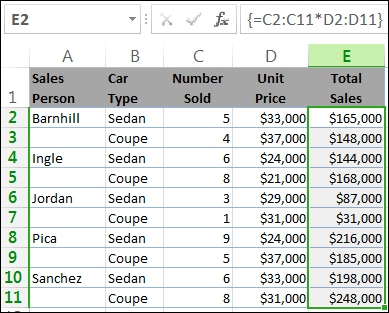
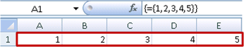
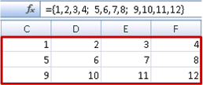
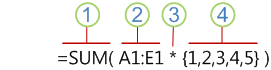
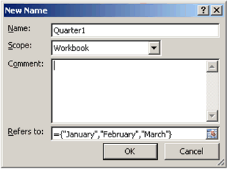

# Microsoft Excel - Guidelines and examples of array formulas

- [Microsoft Excel - Guidelines and examples of array formulas](#microsoft-excel---guidelines-and-examples-of-array-formulas)
  - [Learn about array formulas](#learn-about-array-formulas)
    - [Why use array formulas?](#why-use-array-formulas)
    - [Quick introduction to arrays and array formulas](#quick-introduction-to-arrays-and-array-formulas)
    - [Try it!](#try-it)
      - [Multi-cell array formula](#multi-cell-array-formula)
      - [Create a single-cell array formula](#create-a-single-cell-array-formula)
    - [Array formula syntax](#array-formula-syntax)
    - [Entering and changing array formulas](#entering-and-changing-array-formulas)
      - [Expanding an array formula](#expanding-an-array-formula)
    - [Disadvantages of using array formulas](#disadvantages-of-using-array-formulas)

---

[source](https://kb.nmsu.edu/75306)

To become an Excel power user, you need to know how to use array formulas, which can perform calculations that you can't do by using non-array formulas.

## Learn about array formulas

Array formulas are often referred to as CSE (Ctrl+Shift+Enter) formulas because instead of just pressing Enter, you press Ctrl+Shift+Enter to complete the formula.

### Why use array formulas?

If you have experience using formulas in Excel, you know that you can perform some fairly sophisticated operations. For example, you can calculate the total cost of a loan over any given number of years. You can use array formulas to do complex tasks, such as:

- Count the number of characters that are contained in a range of cells.
- Sum only numbers that meet certain conditions, such as the lowest values in a range or numbers that fall between an upper and lower boundary.
- Sum every nth value in a range of values.

### Quick introduction to arrays and array formulas

An array formula is a formula that can perform multiple calculations on one or more of the items in an array. You can think of an array as a row of values, a column of values, or a combination of rows and columns of values. Array formulas can return either multiple results or a single result. For example, you can create an array formula in a range of cells and use the array formula to calculate a column or row of subtotals. You can also place an array formula in a single cell and calculate a single amount. An array formula that includes multiple cells is called a multi-cell formula, and an array formula in a single cell is called a single-cell formula.

The examples in the next section show you how to create multi-cell and single-cell array formulas.

### Try it!

This exercise shows you how to use multi-cell and single-cell array formulas to calculate a set of sales figures. The first set of steps uses a multi-cell formula to calculate a set of subtotals. The second set uses a single-cell formula to calculate a grand total.

#### Multi-cell array formula

Here is a workbook embedded in the browser. Although it contains sample data, you need to know that you can't create or change array formulas in an embedded workbook – you need the Excel program. You can see the answers in the embedded workbook, and some text that explains how the array formula works, but to really appreciate array formulas, you'll need to see the workbook in Excel.

Create a multi-cell array formulaCopy the entire table below and paste it into cell A1 in a blank worksheet in Excel.Sales 
PersonCar 
TypeNumber 
SoldUnit 
PriceTotal 
SalesBarnhillSedan533000Coupe437000IngleSedan624000Coupe821000JordanSedan329000Coupe131000PicaSedan924000Coupe537000SanchezSedan633000Coupe831000Formula (Grand Total)Grand Total'=SUM(C2:C11\D2:D11)=SUM(C2:C11\D2:D11)To see Total Sales of coupes and sedans for each salesperson, select E2:E11, enter the formula =C2:C11\D2:D11, and then press Ctrl+Shift+Enter.To see the Grand Total of all sales, select cell F11, enter the formula =SUM(C2:C11\D2:D11), and then press Ctrl+Shift+Enter.You can download this workbook by clicking the green Excel button in the black bar at the bottom of the workbook. Then you can open the file in Excel, select the cells containing the array formulas, and press Ctrl+Shift+Enter to make the formula work.If you're working along in Excel, be sure that Sheet1 is active, and then select cells E2:E11. Press F2 and then type the formula =C2:C11\D2:D11 in the current cell of E2. If you press Enter, you'll see that it enters the formula only in cell E2 and displays 165000. Instead, after typing the formula, press Ctrl+Shift+Enter instead of just Enter. Now you'll see results in cells E2:E11. Notice that in the formula bar, the formula appears as {=C2:C11\D2:D11}. That tells you that it's an array formula, as shown in the following table.When you press Ctrl+Shift+Enter, Excel surrounds the formula with brace characters ({ }) and inserts an instance of the formula in each cell of the selected range. This happens very quickly, so what you see in column E is the total sales amount for each car type for each salesperson. If you select E2, then select E3, E4, and so on, you'll see that the same formula is shown: {=C2:C11\D2:D11}.

#### Create a single-cell array formula

In cell F10 of the workbook, type the following formula, and then press Ctrl+Shift+Enter:

=SUM(C2:C11\D2:D11)

In this case, Excel multiplies the values in the array (the cell range C2 through D11) and then uses the SUM function to add the totals together. The result is a grand total of $1,590,000 in sales. This example shows how powerful this type of formula can be. For example, suppose you have 1,000 rows of data. You can sum part or all of that data by creating an array formula in a single cell instead of dragging the formula down through the 1,000 rows.

Also, notice that the single-cell formula in cell G11 is completely independent of the multi-cell formula (the formula in cells E2 through E11). This is another advantage of using array formulas — flexibility. You could change the formulas in column E or delete that column altogether, without affecting the formula in G11.

Array formulas also offer these advantages:

- Consistency  If you click any of the cells from E2 downward, you see the same formula. That consistency can help ensure greater accuracy.
- Safety  You cannot overwrite a component of a multi-cell array formula. For example, click cell E3 and press Delete. You have to either select the entire range of cells (E2 through E11) and change the formula for the entire array, or leave the array as is. As an added safety measure, you have to press Ctrl+Shift+Enter to confirm the change to the formula.
- Smaller file sizes  You can often use a single array formula instead of several intermediate formulas. For example, the workbook uses one array formula to calculate the results in column E. If you had used standard formulas (such as `=C2\D2, C3\D3, C4\D4…)`, you would have used 11 different formulas to calculate the same results.

### Array formula syntax

In general, array formulas use standard formula syntax. They all begin with an equal (=) sign, and you can use most of the built-in Excel functions in your array formulas. The key difference is that when using an array formula, you press Ctrl+Shift+Enter to enter your formula. When you do this, Excel surrounds your array formula with braces — if you type the braces manually, your formula will be converted to a text string, and it won't work.

Array functions are a really efficient way to build a complex formula. The array formula `=SUM(C2:C11\D2:D11)` is the same as this: `=SUM(C2\D2,C3\D3,C4\D4,C5\D5,C6\D6,C7\D7,C8\D8,C9\D9,C10\D10,C11\D11)`.

### Entering and changing array formulas

Important  Press Ctrl+Shift+Enter whenever you need to enter or edit an array formula. This applies to both single-cell and multi-cell formulas.

Whenever you work with multi-cell formulas, also remember:

- Select the range of cells to hold your results before you enter the formula. You did this when you created the multi-cell array formula when you selected cells E2 through E11.
- You can't change the contents of an individual cell in an array formula. To try this, select cell E3 in the workbook and press Delete. Excel displays a message that tells you that you can't change part of an array.
- You can move or delete an entire array formula, but you can't move or delete part of it. In other words, to shrink an array formula, you first delete the existing formula and then start over.
- To delete an array formula, select the entire formula (for example, =C2:C11\D2:D11), press Delete, and then press Ctrl+Shift+Enter.
- You can't insert blank cells into or delete cells from a multi-cell array formula.

#### Expanding an array formula

At times, you may need to expand an array formula. The process is not complicated, but be sure to follow the guidance above.

On this worksheet, we've added some more rows of sales, in rows 12 through 17. Here, we want to update the array formulas so that they'll now include these additional rows.

Be sure to do this in the Excel desktop program (after you've downloaded the workbook to your computer).

Expand an array formulaCopy this entire table to cell A1 in an Excel worksheet.

Sales PersonCar TypeNumber SoldUnit PriceTotal Sales  
Barnhill Sedan 533000 165000 Coupe 437000 148000   
Ingle Sedan 624000 144000 Coupe 821000 168000  
Jordan Sedan 329000 87000 Coupe 131000 31000   
Pica Sedan 924000 216000 Coupe 537000 185000   
Sanchez Sedan 633000 198000 Coupe 831000 248000   
Toth Sedan 227000 Coupe 330000  
Wang Sedan 422000 Coupe 141000   
Young Sedan 532000 Coupe 336000 
Grand Total

Select cell E18, enter the Grand Total formula `=SUM(C2:C17\D2:D17)` in cell A20, and press `Ctrl+Shift+Enter`. 

The answer should be 2,131,000. Select the range of cells that contains the current array formula (E2:E11), plus the empty cells (E12:E17) that are next to the new data. In other words, select cells E2:E17.Press F2 to switch to edit mode.In the formula bar, change C11 to C17, change D11 to D17, and then press Ctrl+Shift+Enter. 
Excel updates the formula in cells E2 through E11 and places an instance of the formula in the new cells, E12 through E17.Type the array formula = SUM(C2:C17\D2\D17) in cell F17 so that it refers to cells from row 2 through row 17, and press Ctrl+Shift+Enter to enter the array formula. 
The new grand total should be 2,131,000.

### Disadvantages of using array formulas

Array formulas are great, but they can have some disadvantages:

- You may occasionally forget to press Ctrl+Shift+Enter. It can happen to even the most experienced Excel users. Remember to press this key combination whenever you enter or edit an array formula.
- Other users of your workbook might not understand your formulas. In practice, array formulas are generally not explained in a worksheet. Therefore, if other people need to modify your workbooks, you should either avoid array formulas or make sure those people know about any array formulas and understand how to change them, if they need to.
- Depending on the processing speed and memory of your computer, large array formulas can slow down calculations.

Learn about array constantsArray constants are a component of array formulas. You create array constants by entering a list of items and then manually surrounding the list with braces ({ }), like this:={1,2,3,4,5}By now, you know you need to press Ctrl+Shift+Enter when you create array formulas. Because array constants are a component of array formulas, you surround the constants with braces by manually typing them. You then use Ctrl+Shift+Enter to enter the entire formula.If you separate the items by using commas, you create a horizontal array (a row). If you separate the items by using semicolons, you create a vertical array (a column). To create a two-dimensional array, you delimit the items in each row by using commas and delimit each row by using semicolons.Here's an array in a single row: {1,2,3,4}. Here's an array in a single column: {1;2;3;4}. And here's an array of two rows and four columns: {1,2,3,4;5,6,7,8}. In the two row array, the first row is 1, 2, 3, and 4, and the second row is 5, 6, 7, and 8. A single semicolon separates the two rows, between 4 and 5.As with array formulas, you can use array constants with most of the built-in functions that Excel provides. The following sections explain how to create each kind of constant and how to use these constants with functions in Excel.Create one-dimensional and two-dimensional constantsThe following procedures will give you some practice in creating horizontal, vertical, and two-dimensional constants.Create a horizontal constantUse the workbook from the previous examples, or create a new workbook.Select cells A1 through E1.In the formula bar, enter the following formula, and then press Ctrl+Shift+Enter:={1,2,3,4,5}In this case, you should type the opening and closing braces ({ }).The following result is displayed.

Create a vertical constantIn your workbook, select a column of five cells.In the formula bar, enter the following formula, and then press Ctrl+Shift+Enter:={1;2;3;4;5}The following result is displayed.

Create a two-dimensional constantIn your workbook, select a block of cells four columns wide by three rows high.In the formula bar, enter the following formula, and then press Ctrl+Shift+Enter:={1,2,3,4;5,6,7,8;9,10,11,12}You see the following result:

Use constants in formulasHere is a simple example that uses constants:In the sample workbook, create a new worksheet.In cell A1, type 3, and then type 4 in B1, 5 in C1, 6 in D1, and 7 in E1.In cell A3, type the following formula, and then press Ctrl+Shift+Enter:=SUM(A1:E1\{1,2,3,4,5})Notice that Excel surrounds the constant with another set of braces, because you entered it as an array formula.

The value 85 appears in cell A3.The next section explains how the formula works.Array constant syntaxThe formula you just used contains several parts.

1. Function2. Stored array3. Operator4. Array constantThe last element inside the parentheses is the array constant: {1,2,3,4,5}. Remember that Excel does not surround array constants with braces; you actually type them. Also remember that after you add a constant to an array formula, you press Ctrl+Shift+Enter to enter the formula.Because Excel performs operations on expressions enclosed in parentheses first, the next two elements that come into play are the values stored in the workbook (A1:E1) and the operator. At this point, the formula multiplies the values in the stored array by the corresponding values in the constant. It's the equivalent of:=SUM(A1\1,B1\2,C1\3,D1\4,E1\5)Finally, the SUM function adds the values, and the sum 85 appears in cell A3.To avoid using the stored array and to just keep the operation entirely in memory, replace the stored array with another array constant:=SUM({3,4,5,6,7}\{1,2,3,4,5})To try this, copy the function, select a blank cell in your workbook, paste the formula into the formula bar, and then press Ctrl+Shift+Enter. You'll see the same result as you did in the earlier exercise that used the array formula:=SUM(A1:E1\{1,2,3,4,5})Elements that you can use in constantsArray constants can contain numbers, text, logical values (such as TRUE and FALSE), and error values ( such as `#N/A`). You can use numbers in the integer, decimal, and scientific formats. If you include text, you need to surround the text with quotation marks (").Array constants can't contain additional arrays, formulas, or functions. In other words, they can contain only text or numbers that are separated by commas or semicolons. Excel displays a warning message when you enter a formula such as {1,2,A1:D4} or {1,2,SUM(Q2:Z8)}. Also, numeric values can't contain percent signs, dollar signs, commas, or parentheses.Naming array constantsOne of the best way to use array constants is to name them. Named constants can be much easier to use, and they can hide some of the complexity of your array formulas from others. To name an array constant and use it in a formula, do the following:On the Formulas tab, in the Defined Names group, click Define Name.
The Define Name dialog box appears.In the Name box, type Quarter1.In the Refers to box, enter the following constant (remember to type the braces manually):={"January","February","March"}The contents of the dialog box now looks like this:

Click OK, and then select a row of three blank cells.Type the following formula, and then press Ctrl+Shift+Enter.=Quarter1The following result is displayed.

When you use a named constant as an array formula, remember to enter the equal sign. If you don't, Excel interprets the array as a string of text and your formula won't work as expected. Finally, keep in mind that you can use combinations of text and numbers.Troubleshooting array constantsLook for the following problems when your array constants don't work:Some elements might not be separated with the proper character. If you omit a comma or semicolon, or if you put one in the wrong place, the array constant might not be created correctly or you might see a warning message.You might have selected a range of cells that doesn't match the number of elements in your constant. For example, if you select a column of six cells for use with a five-cell constant, the `#N/A` error value appears in the empty cell. Conversely, if you select too few cells, Excel omits the values that don't have a corresponding cell.Array constants in actionThe following examples demonstrate a few of the ways in which you can put array constants to use in array formulas. Some of the examples use the TRANSPOSE function to convert rows to columns and vice versa.Multiply each item in an arrayCreate a new worksheet, and then select a block of empty cells four columns wide by three rows high.Type the following formula, and then press Ctrl+Shift+Enter:={1,2,3,4;5,6,7,8;9,10,11,12}\2Square the items in an arraySelect a block of empty cells four columns wide by three rows high.Type the following array formula, and then press Ctrl+Shift+Enter:={1,2,3,4;5,6,7,8;9,10,11,12}\{1,2,3,4;5,6,7,8;9,10,11,12}Alternatively, enter this array formula, which uses the caret operator (^):={1,2,3,4;5,6,7,8;9,10,11,12}^2Transpose a one-dimensional rowSelect a column of five blank cells.Type the following formula, and then press Ctrl+Shift+Enter:=TRANSPOSE({1,2,3,4,5})Even though you entered a horizontal array constant, the TRANSPOSE function converts the array constant into a column.Transpose a one-dimensional columnSelect a row of five blank cells.Enter the following formula, and then press Ctrl+Shift+Enter:=TRANSPOSE({1;2;3;4;5})Even though you entered a vertical array constant, the TRANSPOSE function converts the constant into a row.Transpose a two-dimensional constantSelect a block of cells three columns wide by four rows high.Enter the following constant, and then press Ctrl+Shift+Enter:=TRANSPOSE({1,2,3,4;5,6,7,8;9,10,11,12})The TRANSPOSE function converts each row into a series of columns.Put basic array formulas to workThis section provides examples of basic array formulas.Create arrays and array constants from existing valuesThe following example explains how to use array formulas to create links between ranges of cells in different worksheets. It also shows you how to create an array constant from the same set of values.Create an array from existing valuesOn a worksheet in Excel, select cells C8:E10, and enter this formula:={10,20,30;40,50,60;70,80,90}Be sure to type { (opening brace) before you type 10, and } (closing brace) after you type 90, because you're creating an array of numbers.Press Ctrl+Shift+Enter, which enters this array of numbers in the cell range C8:E10 by using an array formula. 
On your worksheet, C8 through E10 should look like this:102030405060708090Select the cell range C1 through E3.Enter the following formula in the formula bar, and then press Ctrl+Shift+Enter:=C8:E10A 3x3 array of cells appears in cells C1 through E3 with the same values you seen in C8 through E10.Create an array constant from existing valuesWith cells C1:C3 selected, press F2 to switch to edit mode. 
The array formula should still be = C8:E10.Press F9 to convert the cell references to values. 
Excel converts the values into an array constant. The formula should now be ={10,20,30;40,50,60;70,80,90}, just like C8:E10.Press Ctrl+Shift+Enter to enter the array constant as an array formula.Count characters in a range of cellsThe following example shows you how to count the number of characters, including spaces, in a range of cells.Copy this entire table and paste into a worksheet in cell A1.Select cell A9, and then press Ctrl+Shift+Enter to see the total number of characters in cells A2:A6 (66).Select cell A12, and then press Ctrl+Shift+Enter to see the contents of the longest of cells A2:A6 (cell A3).DataThis is abunch of cells thatcome togetherto form asingle sentence.Total characters in A2:A6=SUM(LEN(A2:A6))Contents of longest cell (A3)=INDEX(A2:A6,MATCH(MAX(LEN(A2:A6)),LEN(A2:A6),0),1)The following formula is used in cell A9 counts the total number of characters (66) in cells A2 through A6.=SUM(LEN(A2:A6))In this case, the LEN function returns the length of each text string in each of the cells in the range. The SUM function then adds those values together and displays the result (66) in the cell that contains the formula, A9.Find the n smallest values in a rangeThis example shows how to find the three smallest values in a range of cells.Select cells A16 through A18. 
This set of cells will hold the results returned by the array formula.In the formula bar, enter the following formula, and then press Ctrl+Shift+Enter:=SMALL(A5:A14,{1;2;3})The values 400, 475, and 500 appear in cells A16 through A18, respectively.This formula uses an array constant to evaluate the SMALL function three times and return the smallest (1), second smallest (2), and third smallest (3) members in the array that is contained in cells A1:A10. To find more values, you add more arguments to the constant and an equivalent number of result cells to the A12:A14 range. You can also use additional functions with this formula, such as SUM or AVERAGE. For example:=SUM(SMALL(A 5 :A1 4 ,{1;2;3}))=AVERAGE(SMALL(A 5 :A1 4 ,{1;2;3}))Find the n largest values in a rangeTo find the largest values in a range, you can replace the SMALL function with the LARGE function. In addition, the following example uses the ROW and INDIRECT functions.Select cells A1 through A3.In the formula bar, enter this formula, and then press Ctrl+Shift+Enter:=LARGE(A5:A14,ROW(INDIRECT("1:3")))The values 3200, 2700, and 2000 appear in cells A1 through A3, respectively.At this point, it may help to know a bit about the ROW and INDIRECT functions. You can use the ROW function to create an array of consecutive integers. For example, select an empty column of 10 cells in your practice workbook, enter this array formula in cells A5:A14, and then press Ctrl+Shift+Enter:=ROW(1:10)The formula creates a column of 10 consecutive integers. To see a potential problem, insert a row above the range that contains the array formula (that is, above row 1). Excel adjusts the row references, and the formula generates integers from 2 to 11. To fix that problem, you add the INDIRECT function to the formula:=ROW(INDIRECT("1:10"))The INDIRECT function uses text strings as its arguments (which is why the range 1:10 is surrounded by double quotation marks). Excel does not adjust text values when you insert rows or otherwise move the array formula. As a result, the ROW function always generates the array of integers that you want.Let us examine the formula that you used earlier — =LARGE(A5:A14,ROW(INDIRECT("1:3"))) — starting from the inner parentheses and working outward: The INDIRECT function returns a set of text values, in this case the values 1 through 3. The ROW function in turn generates a three-cell columnar array. The LARGE function uses the values in the cell range A5:A14, and it is evaluated three times, once for each reference returned by the ROW function. The values 3200, 2700, and 2000 are returned to the three-cell columnar array. If you want to find more values, you add a greater cell range to the INDIRECT function.Finally, you can use this formula with other functions, such as SUM and AVERAGE.Find the longest text string in a range of cellsThis formula works only when a data range contains a single column of cells. On Sheet3, enter the following formula in cell A16, and press Ctrl+Shift+Enter:=INDEX(A6:A9,MATCH(MAX(LEN(A6:A9)),LEN(A6:A9),0),1)The text "bunch of cells that" appears in cell A16.Let's take a closer look at the formula, starting from the inner elements and working outward. The LEN function returns the length of each of the items in the cell range A6:A9. The MAX function calculates the largest value among those items, which corresponds to the longest text string, which is in cell A7.Here's where things get a little complex. The MATCH function calculates the offset (the relative position) of the cell that contains the longest text string. To do that, it requires three arguments: a lookup value, a lookup array, and a match type. The MATCH function searches the lookup array for the specified lookup value. In this case, the lookup value is the longest text string:(MAX(LEN( A6 : A9 ))and that string resides in this array:LEN( A6:A9 )The match type argument is 0. The match type can consist of a 1, 0, or -1 value. If you specify 1, MATCH returns the largest value that is less than or equal to the lookup value. If you specify 0, MATCH returns the first value exactly equal to the lookup value. If you specify -1, MATCH finds the smallest value that is greater than or equal to the specified lookup value. If you omit a match type, Excel assumes 1.Finally, the INDEX function takes these arguments: an array, and a row and column number within that array. The cell range A6:A9 provides the array, the MATCH function provides the cell address, and the final argument (1) specifies that the value comes from the first column in the array.Put advanced array formulas to workThis section provides examples of advanced array formulas.Sum a range that contains error valuesThe SUM function in Excel does not work when you try to sum a range that contains an error value, such as `#N/A`. This example shows you how to sum the values in a range named Data that contains errors.=SUM(IF(ISERROR(Data),"",Data))The formula creates a new array that contains the original values minus any error values. Starting from the inner functions and working outward, the ISERROR function searches the cell range (Data) for errors. The IF function returns a specific value if a condition you specify evaluates to TRUE and another value if it evaluates to FALSE. In this case, it returns empty strings ("") for all error values because they evaluate to TRUE, and it returns the remaining values from the range (Data) because they evaluate to FALSE, meaning that they don't contain error values. The SUM function then calculates the total for the filtered array.Count the number of error values in a rangeThis example is similar to the previous formula, but it returns the number of error values in a range named Data instead of filtering them out:=SUM(IF(ISERROR(Data),1,0))This formula creates an array that contains the value 1 for the cells that contain errors and the value 0 for the cells that don't contain errors. You can simplify the formula and achieve the same result by removing the third argument for the IF function, like this:=SUM(IF(ISERROR(Data),1))If you don't specify the argument, the IF function returns FALSE if a cell does not contain an error value. You can simplify the formula even more:=SUM(IF(ISERROR(Data)\1))This version works because TRUE\1=1 and FALSE\1=0.Sum values based on conditionsYou might need to sum values based on conditions. For example, this array formula sums just the positive integers in a range named Sales:=SUM(IF(Sales>0,Sales))The IF function creates an array of positive values and false values. The SUM function essentially ignores the false values because 0+0=0. The cell range that you use in this formula can consist of any number of rows and columns.You can also sum values that meet more than one condition. For example, this array formula calculates values greater than 0 and less than or equal to 5:=SUM((Sales>0)\(Sales<=5)\(Sales))Keep in mind that this formula returns an error if the range contains one or more non-numeric cells.You can also create array formulas that use a type of OR condition. For example, you can sum values that are less than 5 and greater than 15:=SUM(IF((Sales<5)+(Sales>15),Sales))The IF function finds all values smaller than 5 and greater than 15 and then passes those values to the SUM function.You can't use the AND and OR functions in array formulas directly because those functions return a single result, either TRUE or FALSE, and array functions require arrays of results. You can work around the problem by using the logic shown in the previous formula. In other words, you perform math operations, such as addition or multiplication, on values that meet the OR or AND condition.Compute an average that excludes zerosThis example shows you how to remove zeros from a range when you need to average the values in that range. The formula uses a data range named Sales:=AVERAGE(IF(Sales<>0,Sales))The IF function creates an array of values that do not equal 0 and then passes those values to the AVERAGE function.Count the number of differences between two ranges of cellsThis array formula compares the values in two ranges of cells named MyData and YourData and returns the number of differences between the two. If the contents of the two ranges are identical, the formula returns 0. To use this formula, the cell ranges need to be the same size and of the same dimension (for example, if MyData is a range of 3 rows by 5 columns, YourData must also be 3 rows by 5 columns):=SUM(IF( MyData =YourData,0,1))The formula creates a new array of the same size as the ranges that you are comparing. The IF function fills the array with the value 0 and the value 1 (0 for mismatches and 1 for identical cells). The SUM function then returns the sum of the values in the array.You can simplify the formula like this:=SUM(1\( MyData <> YourData ))Like the formula that counts error values in a range, this formula works because TRUE\1=1, and FALSE\1=0.Find the location of the maximum value in a rangeThis array formula returns the row number of the maximum value in a single-column range named Data:=MIN(IF(Data=MAX(Data),ROW(Data),""))The IF function creates a new array that corresponds to the range named Data. If a corresponding cell contains the maximum value in the range, the array contains the row number. Otherwise, the array contains an empty string (""). The MIN function uses the new array as its second argument and returns the smallest value, which corresponds to the row number of the maximum value in Data. If the range named Data contains identical maximum values, the formula returns the row of the first value.If you want to return the actual cell address of a maximum value, use this formula:=ADDRESS(MIN(IF(Data=MAX(Data),ROW(Data),"")),COLUMN(Data))